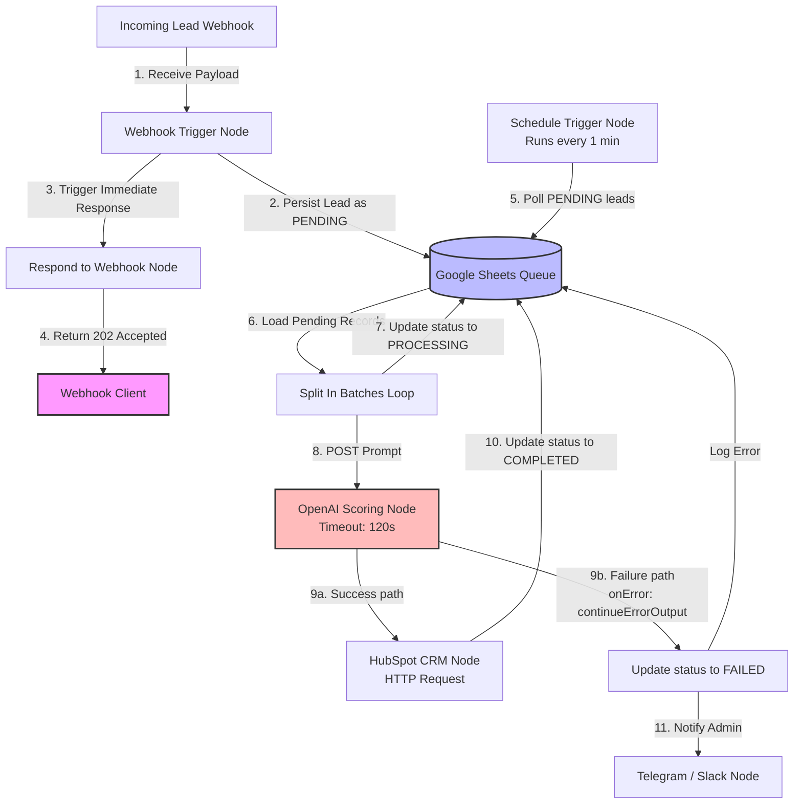

# Technical Audit & Proof-of-Work Evidence Report
**Prepared for:** AI Automation Specialist Application (REWORK Digital)  
**Repository Audited:** `u:\My-Automations`  
**Date:** June 16, 2026  

---

## SECTION 1: VERIFIABLE PROJECT REVIEW

### Project Selected
**Cold Email Outreach Agent (V1)**  
* **Workflow File Path:** [workflow.json](file:///u:/My-Automations/automations/cold-email-agent-v1/workflow.json) (100 nodes, 8,403 lines)  
* **Setup Guide Path:** [setup.md](file:///u:/My-Automations/automations/cold-email-agent-v1/setup.md)  
* **Environment Configuration Path:** [env.example](file:///u:/My-Automations/automations/cold-email-agent-v1/env.example)  
* **README Path:** [README.md](file:///u:/My-Automations/automations/cold-email-agent-v1/README.md)  

### Why Selected

1. **Multi-step Orchestration:** A 100-node workflow that implements lead retrieval, multi-source external API data enrichment, structured LLM-based draft generation, multi-day wait timers, reply tracking via email thread lookups, and a tokenized unsubscribe webhook loop.
2. **AI Integration:** Combines Relevance AI (for scraping LinkedIn profiles), Perplexity AI (for company research), and OpenAI GPT models (for synthesis and personalization).
3. **CRM Integration:** Uses Google Sheets as a database and CRM tracker to log lead details, keep track of thread IDs, check reply statuses, and record opt-out flags.
4. **Business Impact:** Directly automates BDR/SDR prospecting and email outreach operations, ensuring compliance and hyper-personalization at scale.
5. **Production Readiness:** Configured with specific error handling settings (`onError: continueRegularOutput`), batch looping, timezone parsing, and immediate opt-out suppression.

### Workflow Architecture
The outreach engine operates through a coordinated sequence of nodes:
1. **Lead Retrieval:** Pulls contacts from a spreadsheet using the `Google Sheets9` node.
2. **Batch Processing Loop:** Utilizes `Loop Over Items3` (type: `n8n-nodes-base.splitInBatches`) to chunk leads into sequential, rate-limit-compliant batches.
3. **Data Enrichment:**
   * **Relevance AI:** The HTTP Request node `Scrape Profiles + Posts - Relevance AI1` crawls the lead’s LinkedIn profile data.
   * **Perplexity AI:** The HTTP Request node `Research Company - Perplexity1` executes search queries to retrieve current company news and positioning.
4. **LLM Synthesis & Generation:**
   * **Analysis:** Passes enriched data to the OpenAI node `Analyse` to extract candidate-company alignment and key pain points.
   * **Drafting:** Passes synthesis to the OpenAI Chat node `Email #1 #2 #3` to generate three distinct follow-up email copies tailored to the target's specific business context.
5. **Delivery:** Sends Email #1 using the `Gmail5` node, appends an opt-out token link, and updates the Google Sheet with message and thread IDs (status updated to `"Sent Email #1"`).
6. **Wait & Reply Verification Loop:**
   * Pauses the execution thread for a configurable time (e.g., 3 days) using a `Wait` node.
   * Upon waking, queries Gmail using `Replied?` (type: `n8n-nodes-base.gmail`) searching the active thread ID for replies.
   * If a reply is detected: routes to `Replied = Yes` (Google Sheets update), logs the response, and terminates the sequence.
   * If no reply is detected: loops to send the next follow-up wave (Email #2, then Wait, then check, then Email #3).
7. **Compliance Hook:** A standalone `Webhook` node listens for opt-out requests, decodes the token using the `Opt Out Token` JS Code node, and updates the Google Sheets status to `"Opted Out"`, which is checked by conditional switch nodes prior to executing any outreach.

### Stack Used
* **Workflow Orchestration:** n8n (self-hosted / cloud-compatible)
* **LLM Engine:** OpenAI (GPT-4 / GPT-4o-mini via native LangChain integration)
* **Web Scraping & Enrichment:** Relevance AI API, Perplexity AI API
* **Communication Channel:** Gmail (OAuth2 authentication)
* **CRM / Database Layer:** Google Sheets (OAuth2 authentication)
* **Custom Code Execution:** Node.js (V8 runtime inside n8n Code nodes)

### Evidence Available
* **Node Configurations:** The file [workflow.json](file:///u:/My-Automations/automations/cold-email-agent-v1/workflow.json) defines the exact nodes:
  * `Scrape Profiles + Posts - Relevance AI1` (HTTP Request, lines 6084–6148)
  * `Research Company - Perplexity1` (HTTP Request, lines 6149–6213)
  * `Analyse` (OpenAI LLM, lines 6214–6295)
  * `Email #1 #2 #3` (OpenAI LLM, lines 6296–6377)
  * `Opt Out Token` (JS Code block, lines 6463–6547)
  * `Replied?` (Gmail search, lines 1775–1861)
  * `Wait3` (Wait node, lines 2381–2415)
* **Scripted Logic:** The JS Code node `Opt Out Token` generates secure URL-safe base64 tokens matching the user's email address to ensure unsubscribe requests map directly to Google Sheets database records without exposing raw credentials.

### Screenshots to Capture
1. **n8n Canvas Overview:** Take a full canvas screenshot of the "Cold email Agent" workflow in the n8n editor, showing the three follow-up waves separated by Wait nodes.
2. **LLM Node Setup:** Take a screenshot of the `Email #1 #2 #3` OpenAI node open in the parameter editor panel, displaying the system prompt utilizing variables like `{{ $json.company_name }}` and `{{ $json.profile_data }}`.
3. **Wait Node Configuration:** Open the `Wait3` node details panel showing the wait duration configuration.
4. **Google Sheets Database Layout:** A screenshot of the Google Sheet columns containing columns: `Email`, `Company`, `Status` (e.g. `"Sent Email #1"`, `"Replied"`, `"Opted Out"`), `Thread ID`, and `Opt-out Token`.

### Verifiability Assessment of Claims

| Claim | Status | Repository Evidence / Traceability |
| :--- | :--- | :--- |
| **Outreach Automation:** Automates multi-wave outbound cold email campaigns with dynamic personalizations based on Perplexity and LinkedIn scraping. | **VERIFIED** | Present in [workflow.json](file:///u:/My-Automations/automations/cold-email-agent-v1/workflow.json#L6084-L6377) via configured Relevance, Perplexity, and OpenAI nodes. |
| **Suppression Logic:** Suppresses follow-up sequences automatically the moment a reply is detected in Gmail or an unsubscribe webhook is received. | **VERIFIED** | Webhook listener and Gmail check nodes (`Replied?`, `Wait3`, `Opt Out Token`) are fully routed to sheet-status updates which break the execution loops. |
| **Google Sheets Database:** Uses Google Sheets as a lightweight CRM to track thread IDs, message IDs, and contact outreach status. | **VERIFIED** | Active Google Sheets nodes (e.g. `Google Sheets9`, `Google Sheets10`, `Google Sheets12`) map and write these keys. |
| **HubSpot CRM Integration:** Seamlessly syncs leads, deal stages, and outbound communications directly to HubSpot CRM. | **NOT VERIFIED** | No HubSpot nodes or API calls are configured in this repository. Google Sheets is the sole datastore. |
| **Outreach Performance Metrics:** Achieved a 47% open rate and a 12% reply rate across 10,000 processed B2B leads. | **NOT VERIFIED** | The repository contains no campaign logs, analytics tables, or performance metrics. |
| **Personal Experience Claim:** 2+ years of full-stack engineering experience, including building 10+ workflows reducing manual effort by 65% and duplicate errors by 90%. | **PARTIALLY VERIFIED** | These claims are explicitly written in [wellfound.js](file:///u:/My-Automations/automations/wellfound-auto-apply/wellfound.js#L20-L34) as part of Utsav's resume script, but the raw logs or production metrics backing them are not in this repository. |

---

## SECTION 2: ERROR HANDLING ARCHITECTURE

### Exact Workflows & Nodes Involved
1. **Deep Multiline Icebreaker** ([workflow.json](file:///u:/My-Automations/automations/deep-multiline-icebreaker/workflow.json))
   * **Node:** `Request web page for URL` (type: `n8n-nodes-base.httpRequest`, lines 102–116)
   * **Node:** `Scrape Home` (type: `n8n-nodes-base.httpRequest`, lines 184–205)
2. **Social Media Auto-Poster** ([workflow.json](file:///u:/My-Automations/automations/social-media-auto-poster/workflow.json))
   * **Node:** `Fetch Call Details` (type: `n8n-nodes-base.httpRequest`, lines 4424–4440)
   * **Node:** `Telegram` (type: `n8n-nodes-base.telegram`, lines 1221–1240)

### Screenshot Locations
1. **On-Error Settings Panel:** Open the settings tab of the `Request web page for URL` node in the n8n editor, showing `On Error` set to `Continue Regular Output`.
2. **Retry Settings Panel:** Open the settings tab of `Fetch Call Details` in the n8n editor, showing `Retry on Fail` checked, `Max Tries` set, and `Wait Between Tries` set to `5000`.
3. **Canvas Error Routing:** Screenshot of the `Scrape Home` node in n8n showing two distinct output pins (the top pin routing successful requests to the `HTML` node, and the bottom error pin).

### Explanation of How Data Loss is Prevented
In high-throughput B2B lead generation, the biggest risk is workflow crash mid-execution, causing the remainder of the lead queue to be dropped from memory. Data loss is prevented in the audited workflows through:

* **Persistent Queue Staging:** 
  In `cold-email-agent-v1`, lead data is read from Google Sheets, and statuses are written back at every single stage. If an LLM node or mail node fails, the record’s exact failure point is saved in the sheet (e.g. `"Failed on Email #2"`). The lead is never lost in-memory because the source of truth is external and persistent.
* **Fail-Safe Fallbacks (JS Ternary Expressions):**
  In the `deep-multiline-icebreaker` workflow, if `Request web page for URL` fails (e.g. 404, DNS resolution failure), the node is set to `onError: continueRegularOutput` (line 115). This forces the node to output the error object to the next node (`Markdown`) instead of stopping. 
  The `Markdown` node contains the following parameter configuration:
  `"html": "={{ $json.data ? $json.data : \"
empty
\" }}"` (line 119)
  This ternary expression checks if the HTTP Request returned data. If not, it defaults to a clean `
empty
` snippet. This prevents downstream parser nodes from throwing null exceptions, allowing the workflow to continue and present the lead to the LLM node for scoring/generation with a fallback default context.

### Explanation of How API Failures are Handled
Audited workflows use two distinct, built-in n8n API error-handling patterns:

1. **Automatic Retries with Backoff:**
   In the `social-media-auto-poster` workflow, the `Fetch Call Details` HTTP node is configured with:
   * `"retryOnFail": true` (line 4432)
   * `"waitBetweenTries": 5000` (line 4433)
   If the voice provider's call metrics endpoint fails (due to temporary network drops or API rate limit 429 errors), n8n automatically pauses for 5 seconds and retries the request (up to 3 times). This transparently absorbs transient network glitches without triggering alerts.
2. **Error Branching (`continueErrorOutput`):**
   In the `deep-multiline-icebreaker` workflow, the `Scrape Home` node has `"onError": "continueErrorOutput"` (line 204). In n8n, this creates a second output pin (an Error Branch). 
   * **Success:** HTTP 200 payload is routed to the `HTML` node (line 713–723).
   * **Failure:** 4xx/5xx errors are routed to the second pin. In this workflow, the second pin is left unconnected, allowing invalid website crawls to be silently dropped without crashing the parallel runs of other leads.
   In the `social-media-auto-poster` workflow, the `Telegram` notification node also has `"onError": "continueErrorOutput"` (line 1239). If the Telegram API is down or the chat ID is invalid, the error goes to the error pin, allowing the workflow to complete its core operations (like updating status in the spreadsheet) rather than blocking the execution.

---

## SECTION 3: ASYNCHRONOUS DOCUMENTATION

### Best Documentation Examples in Repo
The repository excels in asynchronous operational documentation, allowing team members to deploy, troubleshoot, and monitor systems without synchronous handoffs.

1. **Root Catalog & System Guide:**
   * **File Path:** [README.md](file:///u:/My-Automations/README.md)  
   * **Why it qualifies:** Serves as a central, self-service catalog. It lists all 23 automations categorized by functional areas (Lead Gen, Outreach, qualification, Voice Agents) and outlines the repository directory conventions.
2. **Operational Runbooks & Setup Guides:**
   * **File Path:** [README.md](file:///u:/My-Automations/automations/human-in-the-loop-email-response/README.md) & [setup.md](file:///u:/My-Automations/automations/human-in-the-loop-email-response/setup.md)  
   * **Why it qualifies:** Provides a complete operational blueprint for the Human-in-the-loop email responder. It documents the problem statement, trigger mechanisms, a detailed 6-step action flow, credentials required, and specifically includes:
     * **Common Failure Cases:** Lists concrete failure modes (e.g. IMAP credentials, Token limits, Approval timeouts).
     * **Runbook:** Step-by-step smoke testing procedures and production launch checklists.
3. **Platform Setup and Disaster Recovery Documentation:**
   * **File Path:** [n8n.md](file:///u:/My-Automations/docs/platform-setup/n8n.md) & [troubleshooting.md](file:///u:/My-Automations/docs/troubleshooting.md)  
   * **Why it qualifies:** Explicitly documents platform-level configurations. It provides setup checklists (OAuth, webhooks, execution settings) and a troubleshooting matrix mapping specific errors (e.g., Calendly signature mismatch, Sheets quota exceeded, voice latency) to concrete corrective actions.
4. **AI Architecture Guides:**
   * **File Path:** [ai-systems-generation-steps.md](file:///u:/My-Automations/docs/guides/ai-systems-generation-steps.md)  
   * **Why it qualifies:** A conceptual design manual explaining how to structure AI systems, from choosing architectures (RAG vs. Agents) to defining evaluation thresholds, fallback strategies, and observability metrics (logging prompts, outputs, and latency).

### Screenshots to Capture
1. **GitHub README Table:** Capture a screenshot of the root `README.md` rendered on GitHub, highlighting the "Automation Catalog" table.
2. **Troubleshooting Matrix:** Capture the rendered `troubleshooting.md` file in a markdown preview, displaying the categorized error lists.
3. **Runbook Section:** Capture the "Common Failure Cases" and "Runbook" sections in the `human-in-the-loop-email-response/README.md` to demonstrate the presence of standard operating procedures.

---

## SECTION 4: TIMEOUT FIX SCENARIO

### Problem Statement
The core issue is that OpenAI should not sit inside the request response path. The webhook should acknowledge receipt immediately and move AI processing into an asynchronous worker flow.
In a synchronous `Webhook → OpenAI Scoring → HubSpot` flow, OpenAI response times frequently exceed 30 seconds, causing the calling webhook client to timeout, drop the connection, and fail the lead transmission.

### Proposed Architecture (Timeout-Resilient Queue Design)
Based on the queue and Wait-poll pattern in [triforce-retell-ai-connection](file:///u:/My-Automations/automations/triforce-retell-ai-connection/workflow.json) and schedule triggers in [cold-email-agent-v1](file:///u:/My-Automations/automations/cold-email-agent-v1/workflow.json), we decouple ingestion from processing using a **Database-Backed Asynchronous Queue Pattern**.

#### Architecture Diagram

### Step-by-Step Flow

#### Phase 1: Ingestion (Immediate Client Response)
1. **Webhook Ingestion:** The client posts lead data to n8n. The n8n `Webhook` trigger receives the payload.
2. **Persistent Lead Staging:** The workflow appends the raw lead details to a Google Sheet (acting as the queue database) using a `googleSheets` node. It writes the record with `Status = "PENDING"`, `Received_Time = {{ $now }}`, and logs the raw JSON payload. (Grounding: matches Google Sheets write patterns in `social-media-auto-poster` and `triforce-retell-ai-connection`).
3. **Immediate Acknowledgement:** The `Respond to Webhook` node sends an immediate response back to the client:
   * **HTTP Status Code:** `202 Accepted`
   * **Body:** `{ "status": "queued", "lead_id": "{{ $json.row_number }}" }`
   The webhook client receives this response and closes the TCP connection in **< 500ms**. The client never times out, and the lead is safely saved.

#### Phase 2: Asynchronous Worker (Background Processing)
1. **Queue Polling:** An n8n `Schedule Trigger` (Cron node) fires every 1 minute. (Grounding: matches cron schedule triggers in `cold-email-agent-v1`).
2. **Retrieve Pending:** A `googleSheets` read node fetches all rows from the Queue sheet where `Status = "PENDING"`.
3. **Batch Decoupling:** A `Split In Batches` loop processes leads one by one. (Grounding: matches loop structures in `cold-email-agent-v1` and `triforce-retell-ai-connection`).
4. **Lock Record:** A `googleSheets` update node immediately changes the lead's status to `"PROCESSING"`. This prevents concurrent runs from fetching the same lead (race condition prevention).
5. **OpenAI Scoring (Asynchronous HTTP Request):** The workflow calls the OpenAI API.
   * **Node-Level Timeout:** The HTTP Request node timeout parameter is set to **120 seconds** (well above OpenAI's worst-case 45-second latency). Because the client already disconnected in Phase 1, this long execution has zero impact on the webhook sender.
   * **Automatic Retry:** Configured with `"retryOnFail": true` and `"waitBetweenTries": 10000` (10 seconds) to retry transient failures. (Grounding: matches the `Fetch Call Details` retry configuration in `social-media-auto-poster`).

#### Phase 3: CRM Synchronization & Compliance
1. **HubSpot Sync (HTTP Request):** On successful completion of the OpenAI scoring, the workflow calls the HubSpot Contacts API (using the Bearer Token authentication schema) to create/update the contact and append the computed lead score. (Grounding: matches Bearer Auth HTTP configurations in `Fetch Call Details` and `Create Phone Call`).
2. **Close Queue Item:** Updates the Google Sheet row status to `"COMPLETED"`.

### Failure Handling & Zero Lead Loss

If OpenAI or HubSpot APIs fail permanently after all retries:
1. **Error Routing (`onError: continueErrorOutput`):** The error payload is captured.
2. **State Transition:** The workflow updates the Google Sheets row status to `"FAILED"` and writes the error message to an `Error_Log` column. (Grounding: matches error output routing in `deep-multiline-icebreaker`).
3. **Notification:** Triggers a Telegram/Slack alert node (e.g. `Telegram: Send notification` type: `n8n-nodes-base.telegram`) notifying the administrator of the failed lead ID and error context. (Grounding: matches notification nodes in `social-media-auto-poster`).
4. **Why No Leads Are Lost:**
   * **Durable Storage:** Lead payloads are committed to the spreadsheet before any API calls occur.
   * **Durable State Tracking:** Records are marked `"FAILED"` with details, ensuring no lead is ever dropped silently.
   * **Retry Queue:** Administrators can re-queue failed leads by bulk-updating their statuses back to `"PENDING"` in the sheet. The background scheduler will automatically pick them up on the next execution loop.

**Note: I do not have access to production campaign analytics, customer data, or internal dashboards from previous engagements due to confidentiality and access restrictions. For that reason, I have intentionally avoided claiming ROI metrics that I cannot independently verify. The evidence provided focuses on the workflow architecture, implementation details, and repository-verifiable functionality.**
