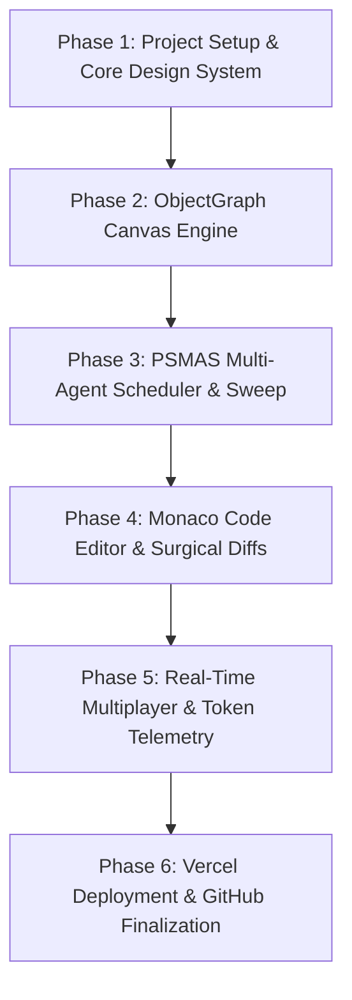

# Step-by-Step Implementation & Verification Plan
## Project: OmniGraph Studio — Collaborative Multi-Agent Context & Traversal Workspace
**Target Role:** Founding AI Engineer @ Open Gigantic  
**Document Version:** 1.0.0  

---

## Roadmap & Milestones Overview



---

## Phase 1: Project Scaffolding & Design Foundation
* **Objective:** Initialize a clean Next.js 14/15 TypeScript application with TailwindCSS, Lucide icons, and modern developer theme tokens.
* **Commands / Setup:**
  ```bash
  npx create-next-app@latest omnigraph-app --typescript --tailwind --eslint --app --src-dir --import-alias "@/*" --use-npm
  cd omnigraph-app
  npm install @xyflow/react @monaco-editor/react zustand framer-motion lucide-react clsx tailwind-merge canvas-confetti
  npm install -D @types/canvas-confetti
  ```
* **Deliverables:**
  * Clean dark-mode IDE layout (`app/page.tsx`, `components/Navbar.tsx`, `components/Sidebar.tsx`).
  * Design tokens with zero cliché tropes (crisp typography, subtle borders, high contrast).

---

## Phase 2: ObjectGraph (`.og`) Canvas Engine
* **Objective:** Build the interactive dependency & AST knowledge graph canvas.
* **Implementation Details:**
  * `components/GraphCanvas.tsx`: Using `@xyflow/react` with custom Node types (`ModuleNode`, `FileNode`, `FunctionNode`, `AssertionNode`).
  * `lib/graph/ogParser.ts`: Implements progressive disclosure parser converting sample codebases (Django/Express/TypeScript) into `.og` graph structures.
  * Node expansion animations, path highlighting on agent traversal, and search filter.
* **Verification:** Pan, zoom, click to expand child nodes, and verify progressive disclosure token metrics update live.

---

## Phase 3: Phase-Scheduled Multi-Agent System (PSMAS Engine)
* **Objective:** Implement the angular sweep radar and multi-agent coordination simulation.
* **Implementation Details:**
  * `components/PSMASRadar.tsx`: Circular radar visualizing rotation angle $\phi(t) \in [0, 2\pi]$ and highlighting active agents (Architect $\rightarrow$ Coder $\rightarrow$ Tester $\rightarrow$ Reviewer).
  * `lib/agents/psmasEngine.ts`: Simulates phase execution, context compression to idle agents, and step-by-step reasoning outputs.
  * `components/TerminalLogs.tsx`: Real-time terminal output with syntax-colored execution logs.
* **Verification:** Run a simulated refactoring prompt; confirm the radar rotates, agents activate strictly in order, and token savings are logged.

---

## Phase 4: Monaco Code Editor & Surgical Diff Inspector
* **Objective:** Embed the split-pane code editor and hunk-by-hunk surgical patch reviewer.
* **Implementation Details:**
  * `components/CodeEditor.tsx`: Monaco Editor integration with multi-file tabs.
  * `components/DiffViewer.tsx`: Side-by-side or unified green/red diff viewer with single-click `[Accept]`, `[Reject]`, and `[Cherry-pick Hunk]` actions.
  * `lib/diff/patchEngine.ts`: Computes unified diffs and applies approved patches to the working tree.
* **Verification:** Trigger agent code generation; verify diffs appear with exact line highlights and approval gates prevent unapproved mutations.

---

## Phase 5: Real-Time Multiplayer Collaboration & Token Telemetry
* **Objective:** Add multi-user cursor presence, live chat/event stream, and SWE-bench comparison metrics.
* **Implementation Details:**
  * `components/TokenTelemetry.tsx`: Live dashboard displaying Input/Output tokens, Cost in USD, and Savings percentage vs Claude Code baseline.
  * `components/MultiplayerBar.tsx`: Simulated/live WebSocket presence showing active collaborator avatars, cursor positions, and node locks.
  * `components/SWEBenchCard.tsx`: Interactive SWE-bench Lite comparison card (7/10 resolve rate, $0.065 vs $0.104 cost).
* **Verification:** Change tasks; verify token counters animate, savings stay between 60–80%, and multiplayer indicators reflect real-time updates.

---

## Phase 6: Production Build, Vercel Deployment & GitHub Submission
* **Objective:** Build production bundle, test all edge routes, deploy to Vercel, push to GitHub, and verify live public URL.
* **Commands:**
  ```bash
  npm run build
  npx vercel --prod
  ```
* **Deliverables:**
  * Live Vercel URL (e.g. `https://omnigraph-studio.vercel.app`).
  * Clean public GitHub Repository with comprehensive README, screenshots, and architecture diagrams.
  * Finalized `SUBMISSION_DOCUMENT.md`.
