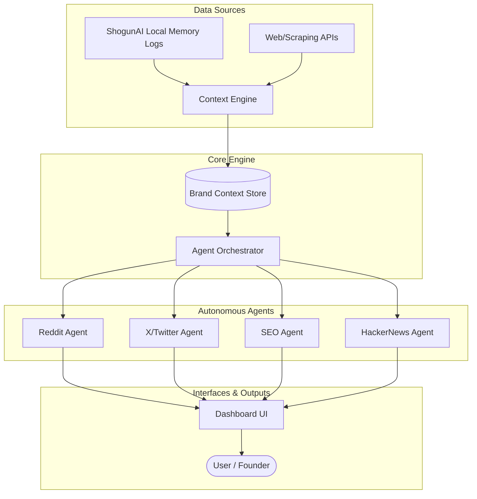

# ShogunCMO — Technical Architecture & System Design

## Architecture Overview

ShogunCMO is an autonomous, multi-agent AI marketing system designed specifically for ShogunAI. It acts as an internal AI CMO, leveraging ShogunAI's "live memory" context to automate Go-To-Market (GTM) execution across multiple channels while maintaining a rigorous, unified brand voice. 



## Technology Stack

- **Frontend:** Next.js 14+ (App Router), TailwindCSS
- **Backend:** Next.js API Routes / Node.js
- **Database:** SQLite (via `better-sqlite3`) for prototype speed, facilitating rapid local development without heavy infrastructure.
- **AI/LLM:** OpenAI API (GPT-4o) for high-reasoning tasks, configurable for alternatives (Claude 3.5 Sonnet) as needed.
- **Search APIs:** Tavily for real-time web search, Tinyfish CLI for niche discovery.
- **Scraping:** Firecrawl API for extracting competitor data and deep web analysis.

## Module Breakdown

### 1. Context Engine (Memory Ingestion)
The Context Engine acts as the bridge between ShogunAI's core product (the local workday memory) and the marketing engine.
- **Input:** Reads sanitized local memory logs, product updates, user interviews, and competitor data.
- **Processing:** Uses LLMs to extract high-signal marketing insights (e.g., pain points identified in customer calls, new features shipped in GitHub).
- **Output:** Structured JSON updates pushing into the Brand Context Store, ensuring the CMO's knowledge is always current.

### 2. Brand Context Store
A centralized truth repository ensuring all agents speak with the exact same voice and understand the current GTM strategy.
- **Storage:** Persisted locally as `brand_context.json` (or within SQLite).
- **Schema Contents:** 
  - **Product Info:** Core features, recent updates, pricing.
  - **ICP:** Hyper-specific Ideal Customer Profiles (e.g., "macOS power users suffering from context fragmentation").
  - **Brand Voice:** Tone guidelines (e.g., "high-signal, concise, no corporate fluff, YC/Silicon Valley ethos").
  - **Competitors:** Extracted profiles of alternatives like Rewind/Recall, and conversational bots.

### 3. Agent Orchestrator
The central nervous system that schedules, triggers, and coordinates the specialized agents.
- **Scheduling:** Uses node-cron or background queues to trigger agents on specific cadences (e.g., SEO agent daily, Reddit agent twice a day).
- **Coordination:** Passes the latest `brand_context` to agents before they run. Ensures agents don't duplicate work or contradict each other.

### 4. Reddit Agent
- **Search Flow:** Uses Search APIs to find high-intent threads across relevant subreddits (e.g., r/macapps, r/productivity, r/ycombinator).
- **Thread Scoring:** Evaluates threads based on relevance to the ShogunAI ICP, recency, and engagement.
- **Reply Drafting:** Drafts authentic, value-add replies in the brand voice, avoiding spam.
- **Output Format:** Delivers prioritized threads and draft replies to the Dashboard UI for the founder to review and manually post natively (ensuring ban-safety).

### 5. X (Twitter) Agent
- **Content Generation:** Ingests recent ShogunAI milestones (e.g., YC Hackathon wins, NVIDIA Inception membership) to generate engaging posts and threads.
- **Thread Drafting:** Creates structured threads highlighting ShogunAI's unique approach (action-oriented vs. amnesia-prone conversational AI).
- **Scheduling:** Queues drafts in the dashboard for review and approval.

### 6. SEO Agent
- **Keyword Analysis:** Uses search data to identify mid-funnel content gaps related to "Personal AGI", "macOS AI assistants", etc.
- **Content Gap Detection:** Analyzes competitor visibility and identifies programmatic SEO opportunities.
- **Article Drafting:** Drafts high-quality, long-form content optimized for both traditional search and AI engine (GEO) citations.

### 7. HackerNews Agent
- **Detection:** Monitors HN for relevant discussions on memory tools, AI agents, or productivity.
- **Drafting:** Prepares "Show HN" launch drafts, timing them for peak traffic, and drafts high-signal, technical comments suitable for the HN audience.

### 8. Dashboard UI
- **Pages:** 
  - `/overview`: High-level metrics, pending approvals.
  - `/brand-context`: Interface to review/edit the Brand Context Store.
  - `/agents/[agentId]`: Specific views for each agent's queue (e.g., Reddit Drafts, Twitter Queue).
- **Components:** Draft Review Cards, Approve/Reject buttons, Agent Status indicators.
- **Data Flow:** React components fetch data via SWR/React Query from Next.js API routes, displaying SQLite data in real-time.

## Data Models & Schemas

### `brand_context`
```json
{
  "product_name": "ShogunAI",
  "tagline": "The AI-native personal operating system.",
  "brand_voice": ["concise", "technical", "action-oriented"],
  "icp": [
    {
      "persona": "Founder/Developer",
      "pain_point": "Context fragmentation across siloed tools."
    }
  ],
  "competitors": ["Rewind", "Recall", "ChatGPT"]
}
```

### `drafts`
```json
{
  "id": "uuid",
  "agent_type": "reddit|twitter|seo|hn",
  "source_url": "https://reddit.com/r/...",
  "draft_content": "String content...",
  "status": "pending|approved|rejected",
  "created_at": "timestamp"
}
```

### `agent_runs`
```json
{
  "id": "uuid",
  "agent_type": "reddit",
  "started_at": "timestamp",
  "completed_at": "timestamp",
  "items_processed": 15,
  "drafts_generated": 3,
  "status": "success|failed"
}
```

## API Routes

| Endpoint | Method | Purpose |
|---|---|---|
| `/api/context` | GET/PUT | Retrieve or update the Brand Context Store |
| `/api/agents/run` | POST | Manually trigger a specific agent |
| `/api/drafts` | GET | List all drafts (filterable by agent/status) |
| `/api/drafts/:id` | PATCH | Approve, reject, or edit a specific draft |
| `/api/logs` | GET | Fetch agent execution logs and metrics |

## Directory Structure

```text
/shoguncmo
├── /src
│   ├── /app
│   │   ├── /api              # Next.js API routes
│   │   ├── /dashboard        # Dashboard UI pages
│   │   └── layout.tsx
│   ├── /components           # Reusable UI components (Tailwind)
│   ├── /lib
│   │   ├── /agents           # Core agent logic (Reddit, SEO, etc.)
│   │   ├── /db               # SQLite database configuration & schemas
│   │   ├── /llm              # OpenAI API wrappers and prompt templates
│   │   └── /scraping         # Firecrawl and Search API utilities
│   └── /types                # TypeScript interfaces and schemas
├── brand_context.json        # Seed/fallback context file
├── tailwind.config.js
├── package.json
└── README.md
```

## Security & Privacy Considerations
- **Local-First Processing:** As ShogunCMO processes ShogunAI's local memory logs, extreme care must be taken. The Context Engine should sanitize PII or sensitive code before sending data to external LLMs (OpenAI).
- **API Keys:** Secure storage of API keys (OpenAI, Firecrawl, Tavily) using `.env.local` and Next.js server-side only execution.
- **Account Ban Safety:** Agents (like Reddit/HN) deliberately operate in "draft mode" rather than auto-posting to avoid platform API bans and preserve authentic founder interaction.

## Deployment Strategy
- **Initial Prototype:** Run locally alongside the ShogunAI desktop app to maintain the privacy ethos.
- **Production Dashboard:** Deploy the Next.js application to Vercel for the web dashboard, utilizing serverless functions for API routes.
- **Database:** Migrate from local SQLite to Turso (edge SQLite) or Supabase when multi-device syncing or team access is required.
