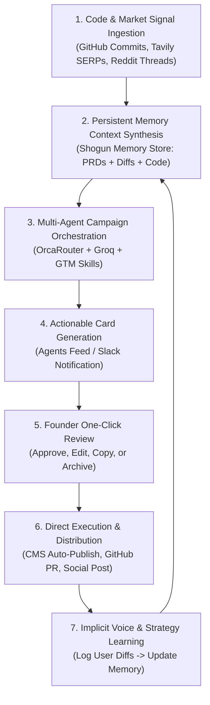

# ShogunCMO — Product Strategy & Strategic Architecture

> **One-Sentence Product Definition:**
> **ShogunCMO** is a continuous, memory-first AI growth engine for technical startups that converts real-time codebase commits, internal specs, and market signals into high-converting GTM campaigns across community, SEO, social, and developer launch channels.

> **What the First Working Version Must Prove:**
> The MVP must prove that an automated engine can continuously ingest a startup's internal codebase changes (via GitHub) and external market chatter (via Tavily/Firecrawl/Reddit), synthesize them through persistent memory without context drift, and present zero-friction content/PR drafts for founder approval that require minimal editing and generate verifiable organic traction.

---

## Executive Summary & Background Context

ShogunAI (developed by Select, Inc., based in Tokyo, Japan, led by founder Toru Tano) recently won 1st Place at the Y Combinator "c0mpiled" hackathon (July 2026) and joined the NVIDIA Inception program. ShogunAI's core product is an "AI-native personal operating system" centered around **Continuous Personal Memory** captured locally. 

As a lean, technical team preparing for a major public Product Hunt launch and waitlist conversion, ShogunAI needs high-quality, continuous Go-To-Market (GTM) execution without the overhead of a multi-person marketing team or expensive external agency ($3,000–$5,000/month). **ShogunCMO** is built first as an internal tool to automate ShogunAI's own marketing, with the clear architectural path to become a commercial B2B product for other technical startups.

---

## A. Product Thesis

Traditional marketing tools act as passive analytics dashboards or isolated copy generators (e.g., Jasper, ChatGPT), forcing founders to act as human integration layers. Modern "AI CMO" competitors like Okara.ai automate execution via 24-hour batch cron jobs, but rely on static website scrapes that drift out of sync with actual product development.

**ShogunCMO's Thesis:** Marketing for technical startups should be an automated, event-driven extension of software engineering. By connecting directly to codebase commits, internal PRDs, and real-time social conversations via a **Persistent Memory Engine**, an AI CMO can generate authentic, context-rich marketing campaigns continuously—turning shipping velocity directly into distribution velocity.

---

## B. Core User Problem

Technical founders and lean startup teams suffer from a fundamental mismatch between building capability and distribution bandwidth:

1. **Context Friction & Agency Loss:** Explaining complex technical features (e.g., local vector memory, RAG architectures, WASM runtimes) to non-technical marketers or agencies takes longer than writing the code itself.
2. **Context Drift:** Generic AI writing tools suffer from "amnesia." They generate hollow marketing fluff because they only read the public landing page, missing new commits, unreleased features, or internal positioning debates.
3. **Execution Fatigue:** Founders know they must post on Twitter/X, Reddit, LinkedIn, Hacker News, and their blog daily. However, manual monitoring and writing from scratch leads to burnout and inconsistent marketing cadence.
4. **Channel Mismatch:** Standard marketing tools push generic B2B SaaS tactics, failing to execute builder-centric, developer-native playbooks (e.g., Show HN, r/Localllama threads, Product Hunt launch sequences).

---

## C. Why Okara is the Reference Product

Okara.ai is the current gold standard in the "AI CMO" space because it moved beyond "copilots" into **autonomous execution**:
- **Execution Over Reporting:** Rather than outputting an audit PDF, Okara opens GitHub PRs for technical SEO and auto-publishes blogs to Webflow/WordPress.
- **Unified Strategy Context Store:** All agents draw from a single source of truth (`product-information.md`, `brand-voice.md`, `competitor-analysis.md`, `marketing-strategy.md`).
- **Push-Based Approvals:** By sending drafts and daily digests directly to messaging apps (WhatsApp/Telegram), Okara fits into a founder's existing mobile workflow.
- **Tinder-Style Task Staging:** The "Agents Feed" provides a clean Inbox Zero queue with 1-click actions ("Publish", "Copy to Clipboard", "Mark Done").

---

## D. What We Should Reproduce from Okara

1. **High-Magic Onboarding:** Crawling the domain upon signup to generate the initial strategy context with zero manual effort.
2. **Transparent, Editable Strategy Context:** Exposing product positioning, brand voice, and competitor profiles as user-editable Markdown documents in a "Company" panel.
3. **The Inbox Zero Feed UX:** A single, centralized task queue ("Agents Feed") categorized into *Current* and *Archived* items with explicit action buttons.
4. **Ban-Safe Community Staging:** Staging Reddit and Hacker News responses as pre-formatted text with 1-click "Copy to Clipboard" and direct thread links (preventing API auto-posting bans).
5. **Technical SEO Coding Agent:** Automatically opening Pull Requests on GitHub for technical fixes, structured data (JSON-LD), and `llms.txt` maintenance.

---

## E. What We Should Deliberately NOT Reproduce

1. **Static 24-Hour Batch Cron Architecture:** Do not rely on a dumb 24-hour daily timer. Growth opportunities (e.g., a viral Twitter trend or breaking AI news) expire in hours, not days.
2. **Public Website Scrape as Sole Memory:** Do not restrict memory to `https://company.com`. This causes context drift when the product evolves faster than the landing page.
3. **Siloed Agent Sprawl:** Do not build 10+ disconnected micro-prompts. Instead, use an orchestrated multi-agent workflow where agents share context dynamically.
4. **Manual Writing Instruction Tweaking:** Avoid forcing founders to write complex, repetitive custom instructions for every single channel.
5. **Disconnected Multi-Channel Publishing:** Avoid publishing an isolated blog post that has no alignment with today's social posts or developer updates.

---

## F. ShogunCMO's Strongest Differentiation

1. **Continuous Codebase & Workspace Sync (Anti-Context Drift):** Native integration with GitHub commits, PRDs, and Slack discussions. When Toru merges a new feature PR, ShogunCMO immediately updates its internal memory and drafts a release campaign.
2. **Implicit Learning via Edit Diffs:** When a founder edits an AI-generated draft in the feed before publishing, ShogunCMO logs the diff and automatically refines its `Brand Voice` model without manual prompt tuning.
3. **Event-Driven Real-Time Opportunities:** Real-time social monitoring (powered by Tavily, Firecrawl, and Tinyfish CLI) to hijack trending developer discussions on X, Reddit, and HN within minutes of posting.
4. **Growth Engineering Workflows:** Expanding the Coding Agent beyond meta-tags to autogenerate code for interactive tools, free calculators, and programmatic SEO landing pages directly via GitHub PRs.
5. **Product Hunt & YC Launch Playbooks:** Built-in, battle-tested launch sequences specifically tailored for developer tools, capitalizing on milestones like hackathon wins and beta launches.
6. **Local-First & BYOK Architecture:** Allowing security-conscious technical startups to run memory locally or use Bring-Your-Own-Key (BYOK) setups to keep internal IP confidential.

---

## G. Core Product Loop



---

## H. Core Entities & Data Model (Conceptual Schema)

```text
1. Workspace / Project
   ├── id, name, domain, created_at
   ├── BrandContext (Company Name, Tagline, Target ICP, Core Pain Points)
   ├── StrategyDocs (product-info.md, brand-voice.md, competitor-analysis.md, content-strategy.md)
   └── Integrations (GitHub OAuth, Webflow/WP Tokens, Slack Webhook, Twitter OAuth)

2. MemoryNode (Continuous Memory Store)
   ├── id, workspace_id
   ├── source_type (GitHub Commit, Notion PRD, Slack Thread, User Edit Diff)
   ├── content_vector / raw_text
   ├── metadata (commit_hash, author, timestamp, relevance_weight)
   └── created_at

3. MarketingSignal (Event Trigger)
   ├── id, workspace_id
   ├── type (CodeRelease, KeywordRankDrop, SocialTrend, CompetitorMove)
   ├── payload (JSON: raw thread URL, commit diff, keyword metrics)
   └── status (Unprocessed, Processing, Actioned, Ignored)

4. Campaign (Orchestrated Group)
   ├── id, workspace_id, title, objective
   ├── status (Drafting, Active, Completed)
   └── child_action_card_ids []

5. ActionCard (Feed Item)
   ├── id, workspace_id, campaign_id
   ├── agent_type (SEO, Writer, Reddit, X, LinkedIn, Coding, ProductHunt)
   ├── title, summary, confidence_score
   ├── payload (Markdown Content, Code Diff, Video Script)
   ├── execution_target (CMS, GitHub PR, Clipboard, Social API)
   ├── status (Pending, Approved, Edited, Published, Archived)
   └── user_diff (Original AI Text vs Final Published Text)

6. TerminalLog (Activity Stream)
   ├── id, workspace_id, timestamp
   ├── agent_name, activity_type, message
   └── log_level (Info, Success, Warning, Error)
```

---

## I. Agent & Skill Model

Rather than creating 10+ disjointed micro-agents, ShogunCMO utilizes an **Orchestrator Pattern** leveraging built-in GTM skills:

1. **The CMO Orchestrator Agent:** 
   - *Role:* High-level strategist. Inspects new signals, queries the `MemoryNode` store, and breaks down campaigns into specific task cards.
2. **Research & Signal Discovery Agent:**
   - *Role:* Monitors channels continuously using `Tavily`, `Firecrawl`, and `Tinyfish CLI`.
   - *Skills Embedded:* `competitor-profiling`, `niche-signal-discovery`, `deepline-gtm`.
3. **Content & Copywriting Agent:**
   - *Role:* Drafts high-converting blog posts, X threads, and LinkedIn updates.
   - *Skills Embedded:* `copywriting`, `positioning`, `content-strategy`, `social`.
4. **Community & Founder-Voice Agent:**
   - *Role:* Crafts non-promotional, authentic responses for Reddit, Hacker News, and developer forums.
   - *Skills Embedded:* `community-marketing`, `customer-interviews`.
5. **Growth Engineering & Coding Agent:**
   - *Role:* Analyzes codebase markup, generates `llms.txt`, JSON-LD schemas, and opens GitHub Pull Requests for SEO fixes and programmatic pages.
   - *Skills Embedded:* `seo-strategy`, `programmatic-seo`, `writing-prds`.

---

## J. Integration Model

- **LLM Infrastructure:** 
  - **Groq:** Ultra-low latency generation for real-time social scanning and quick draft generation.
  - **OrcaRouter:** Dynamic LLM routing (falling back to GPT-4o or Claude 3.5 Sonnet for complex strategic planning and code generation, optimizing for cost and speed).
- **Data & Crawling Infrastructure:**
  - **Tavily API:** SERP tracking, competitor news monitoring, real-time web search.
  - **Firecrawl API:** Deep page scraping and markdown conversion.
  - **Tinyfish CLI:** Headless browser automation for deep web actions.
- **Workspace & Developer Environment:**
  - **GitHub API:** Reading commits, PRDs, repository structure; pushing branches and opening PRs.
  - **Corsair.dev / Workspace Layer:** Standardized connection layer for internal Slack, Notion, and Linear signals.
  - **Database:** SQLite (local prototype speed) upgrading to Supabase Postgres + pgvector for production memory storage.
- **Distribution & CMS Integrations:**
  - **Webflow / WordPress / Framer / Sanity:** Auto-publishing blog drafts.
  - **X (Twitter) / LinkedIn APIs:** Direct posting on approval.
  - **Slack / Telegram Webhooks:** Pushing daily digests and approval alerts.

---

## K. Human Approval Model

ShogunCMO adheres to a strict, channel-specific risk model:

| Channel | Risk Level | Execution Mode | Approval Mechanism |
| :--- | :--- | :--- | :--- |
| **Reddit & Hacker News** | High (Risk of ban) | **Draft Only** | 1-Click "Copy to Clipboard" + direct link to thread in feed card. |
| **GitHub Codebase** | High (Risk of broken build) | **PR Only** | Opens branch `shogun-cmo/seo-fix` + Pull Request. Requires founder merge. |
| **Blog / CMS** | Medium | **Configurable** | Default: "Approve & Publish" button in feed. Option to enable auto-publish. |
| **X (Twitter) & LinkedIn** | Medium | **Configurable** | Default: "Approve & Post" button in feed. Option to schedule or auto-post. |
| **Internal Slack Summaries** | Low | **Autonomous** | Auto-posts daily marketing digests and signal alerts directly to `#marketing-cmo`. |

---

## L. Internal ShogunAI Use Cases (Dogfooding Phase)

1. **Automated Feature Release Campaigns:** When Toru merges a PR on ShogunAI's core repository (e.g., *"Added local memory indexing"*), ShogunCMO detects the commit, reads the PRD, and generates:
   - A changelog article for the website.
   - An X/Twitter thread explaining the technical implementation.
   - A Show HN / r/Localllama discussion draft.
2. **Product Hunt Launch Preparation:** Automating the countdown sequence, maker comment drafts, hunter outreach messages, and launch-day updates for ShogunAI's upcoming PH launch.
3. **Continuous GEO & SEO Maintenance:** Keeping `shogunaios.com` ranked #1 for "AI personal OS" and "local AI memory," while ensuring ChatGPT and Perplexity cite ShogunAI accurately via automated `llms.txt` PRs.

---

## M. Future Commercial Use Cases (B2B SaaS Phase)

1. **Bootstrapped Startup Growth Engine:** Solo founders pay $99/mo to turn their GitHub repo into an active, multi-channel marketing department.
2. **Agencies & DevRel Operations:** Digital agencies manage 20+ client accounts simultaneously from a single multi-tenant ShogunCMO workspace.
3. **Security-Conscious Enterprise AI:** Enterprise devtool companies run ShogunCMO in a self-hosted Docker container with BYOK (Bring Your Own Key), keeping proprietary roadmaps private.

---

## N. MVP Scope (Phase 1 — Immediate Build Goal)

- [x] **Context Engine:** Web crawler + GitHub repo parser (README + recent commits).
- [x] **Strategy Store:** Editable `brand-context.json` & strategy docs (`product-info.md`, `brand-voice.md`).
- [x] **Core Agents:**
  - SEO & Writer Agent (Tavily search $\rightarrow$ Blog draft $\rightarrow$ Webflow/WP publish).
  - Community Agent (Firecrawl/Tinyfish Reddit search $\rightarrow$ Draft response $\rightarrow$ Copy button).
  - Coding Agent (GitHub API $\rightarrow$ Generate `llms.txt` $\rightarrow$ Open PR).
- [x] **Dashboard UI:** Next.js frontend featuring **Terminal Log**, **Company Strategy Editor**, **Analytics Summary**, and **Agents Feed**.
- [x] **Approval System:** Single-click "Publish", "Copy", and "Archive" card interactions.

---

## O. V1 Scope (Phase 2 — Enhanced Intelligence & Integrations)

- [ ] **Slack Approval Bot:** Interactive Slack notifications with inline "Approve" buttons.
- [ ] **Implicit Voice Learning:** Diff logging on user edits to fine-tune `brand-voice.md`.
- [ ] **GEO Dashboard:** AI Search visibility tracker across Perplexity, ChatGPT, and Claude.
- [ ] **Multi-Project Support:** Project switcher for managing multiple repos.
- [ ] **OrcaRouter Dynamic Routing:** Balancing fast Groq models with GPT-4o/Claude 3.5 Sonnet.

---

## P. Future Scope (Phase 3 — Platform Commercialization)

- [ ] Multi-tenant workspace architecture & role-based access control (RBAC).
- [ ] Native Stripe subscription & credit usage engine.
- [ ] Full UGC AI Video generation pipeline (Reels/Shorts/TikTok clips).
- [ ] End-to-end Creator & Influencer outreach management.
- [ ] Self-hosted Docker / Local-First BYOK distribution package.

---

## Q. Biggest Product Risks & Mitigations

1. **Risk: Generic AI Fluff (Destroys Brand Credibility).**
   - *Mitigation:* Enforce strict GTM Skill prompt frameworks (`copywriting`, `positioning`) and ground all generation in `MemoryNode` codebase context.
2. **Risk: Notification & Task Fatigue.**
   - *Mitigation:* Capping daily feed cards to the top 3 highest-leverage opportunities using ROI scoring.
3. **Risk: Context Drift.**
   - *Mitigation:* Re-indexing memory whenever a new GitHub PR is merged.

---

## R. Biggest Technical Risks & Mitigations

1. **Risk: Scraper Blocks (Reddit/X/SERPs blocking requests).**
   - *Mitigation:* Use resilient API layers (Tavily, Firecrawl, Tinyfish CLI) rather than brittle raw fetch calls.
2. **Risk: Hallucinated Code / Broken GitHub PRs.**
   - *Mitigation:* Restrict Coding Agent output to strict JSON-LD schemas and markdown `llms.txt` files validated pre-PR.
3. **Risk: LLM Latency & API Cost Blowouts.**
   - *Mitigation:* Use Groq for background scanning and OrcaRouter for cost-effective fallback.

---

## S. Biggest Assumptions Requiring Validation

1. **Assumption 1:** Codebase commits and internal PRDs provide sufficient narrative context to write authentic marketing copy without human interviews.
2. **Assumption 2:** Founders will trust an AI agent to open GitHub PRs and publish blog posts with single-click approvals.
3. **Assumption 3:** Implicit diff-tracking is superior to manual prompt editing for calibrating brand voice.

---

## T. Recommended Demo Scenario for Toru

**Goal:** Demonstrate a 3-minute, high-magic end-to-end loop showing how ShogunCMO converts shipping code directly into distribution.

```text
Step 1: The Trigger (Code Commit)
- Toru merges a PR in ShogunAI's repository: "feat: added instant local vector search indexer".

Step 2: Signal & Memory Ingestion (Terminal View)
- Open ShogunCMO Terminal. Show the live log detect the commit, ingest the diff into Memory, and trigger the Orchestrator.

Step 3: Real-Time Opportunity Discovery (Tavily/Firecrawl)
- Research Agent finds an active thread on r/Localllama posted 20 mins ago: "How are you guys indexing local memory for desktop AI agents?"

Step 4: Actionable Feed Generation (Agents Feed)
- The Agents Feed populates with 3 staged cards:
  1. Card 1 (Community): A technical, authentic Reddit response citing ShogunAI's approach + "Copy to Clipboard" button.
  2. Card 2 (Content): An SEO blog draft ("Why Local Vector Indexing Matters for Personal AI") + "Publish to Webflow" button.
  3. Card 3 (Coding): A GitHub PR update for llms.txt reflecting the new feature + "View PR on GitHub" link.

Step 5: Execution & Verification
- Click "Publish to Webflow". Show the live article rendered on the blog.
- Click "View PR on GitHub". Show the clean, open Pull Request waiting for merge.
```

---

### Master Alignment Summary
- [x] **One Sentence Definition:** Included in header.
- [x] **First Working Version Proof:** Included in header.
- [x] **No Agent Over-Engineering:** Coherent 5-step loop optimizing for end-to-end product value.
- [x] **Incorporates Internal ShogunAI Context:** Fully integrated YC win, Toru's profile, and local memory positioning.
