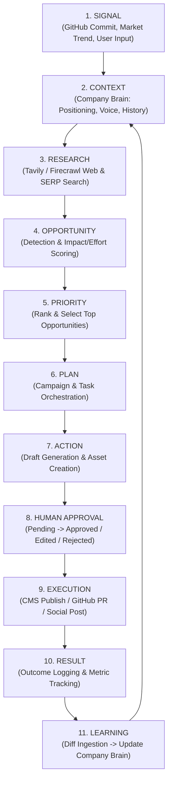
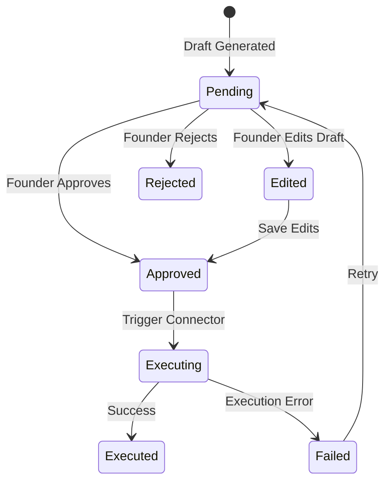

# SHOGUNCMO FINAL MVP SPECIFICATION v2

> **THIS MVP SPECIFICATION V2 IS THE AUTHORITATIVE PRODUCT DEFINITION FOR SHOGUNCMO. IT REPLACES ALL PREVIOUS DRAFTS AND IS STRICTLY FROZEN FOR THE MVP SCOPE.**

---

## 1. Product Definition

**ShogunCMO** is a continuous, memory-first AI Chief Marketing Officer for technical startups that ingests first-party product, codebase, and workspace signals, synthesizes them through a persistent Company Brain, and orchestrates evidence-grounded marketing campaigns across community, content, search, and developer channels with human-in-the-loop approval.

---

## 2. Primary User

**The Technical Founder / Core Team at ShogunAI** (led by Toru Tano and early startup teams) who ship product changes rapidly but lack dedicated marketing headcount and bandwidth to execute high-frequency, authentic GTM distribution.

---

## 3. Problem

Technical founders suffer from **context drift** and **distribution friction**:
1. **Context Drift:** Traditional AI marketing assistants lack persistent product memory. They read static landing pages, generating generic, outdated marketing fluff that fails to reflect unreleased features, commit velocity, or deep technical positioning.
2. **Distribution Friction:** Founders know they must maintain active presences across developer communities (Reddit, Hacker News, X/Twitter, blogs), but manual channel monitoring, draft creation, and task coordination consume bandwidth better spent engineering the product.

---

## 4. Product Principles

1. **First-Party Signal Primacy:** Marketing triggers originate from actual engineering and product work (code commits, specs, releases), turning shipping velocity directly into distribution velocity.
2. **Evidence-Grounded Recommendation:** Every AI proposal must be backed by explicit evidence (triggering signal, Company Brain strategy context, external market research, and confidence metrics).
3. **Decoupled Workflows:** Signals, Opportunities, Campaigns, Tasks, Assets, and Actions are distinct entities—the system dynamically determines appropriate actions rather than producing arbitrary fixed outputs.
4. **Human-in-the-Loop Governance:** Autonomous execution is restricted to read-only research and draft generation. All external side effects (public posting, CMS publishing, GitHub PRs) require explicit human approval.
5. **Continuous Strategy Calibration:** Strategy documents and brand voice are dynamic entities stored within the Company Brain, continuously updated via implicit user feedback (edit diffs) and execution results.

---

## 5. Core Product Loop



---

## 6. Company Brain

The **Company Brain** serves as the central context and memory store for ShogunCMO. It is implemented lightweight (using SQLite + `sqlite-vec` + FTS5 full-text search) without requiring an expensive graph database.

### Core Company Brain Sub-Domains:
- **Company:** Name, domain, stage, founding story, YC/NVIDIA badges.
- **Product:** Feature index, technical architecture, API surface, release changelog.
- **ICP:** Hyper-specific target buyer profiles, developer personas, pain points.
- **Positioning:** "The New Game Shift" narrative, competitive alternatives, unique value vectors.
- **Brand Voice:** Tone guidelines, prohibited fluff words, past founder writing samples.
- **Competitors:** Tracked competitor matrix, positioning gaps, keyword overlaps.
- **Marketing Goals:** Active KPIs (Product Hunt launch target, waitlist velocity, organic search ranking).
- **Product Updates:** Historical database of merged PRs, release notes, and commit summaries.
- **Signals Store:** Stream of ingested internal and external events.
- **Opportunities Store:** Active, scored growth opportunities awaiting campaign assignment.
- **Evidence Vault:** Citations, raw SERP HTML, thread URLs, and research snippets backing AI decisions.
- **Campaigns:** Active and past marketing initiatives with goals and task trees.
- **Assets:** Created content (markdown blogs, JSON-LD schemas, X thread scripts).
- **Actions Log:** Record of approved, rejected, and executed actions.
- **Results & Diffs:** Execution outcomes, performance metrics, and human edit diffs.

---

## 7. Strategy Layer

ShogunCMO maintains four structured **Strategy Context Modules** within the Company Brain (the conceptual equivalent of Okara's strategy documents):

1. `Product Information`: Detailed capabilities, macOS local memory architecture, WASM/vector specs.
2. `Marketing Strategy`: Growth channels, Product Hunt playbooks, content pillars, launch timelines.
3. `Competitor Analysis`: Competitive teardowns (vs Okara, Rewind, Notion AI), positioning foils.
4. `Brand Voice & Tone`: Founder voice rules, technical depth requirements, concise writing style.

> **Context Injection Rule:** Before any agent or skill executes, the Orchestrator injects the relevant subset of these Strategy Context Modules into the LLM prompt window alongside the triggering Signal and Evidence.

---

## 8. Signals

A **Signal** is any internal or external event that indicates potential marketing leverage.

### Signal Model Schema:
```json
{
  "id": "sig_123",
  "type": "github_commit",
  "source": "shogunai/core-repo",
  "timestamp": "2026-08-13T19:00:00Z",
  "payload": {
    "commit_hash": "4f2a9c",
    "author": "toru",
    "message": "feat: added instant local vector search indexer",
    "diff_summary": "Added SQLite vector extension and fast indexing for macOS local logs"
  },
  "status": "unprocessed"
}
```

### Supported Signal Types:
- `github_commit` *(P0 — MVP Focus)*
- `github_release` *(P1)*
- `product_update` *(P1)*
- `website_change` *(P1)*
- `competitor_change` *(P1)*
- `reddit_discussion` *(P1)*
- `hacker_news_discussion` *(P1)*
- `search_opportunity` *(P1)*
- `analytics_anomaly` *(Deferred)*
- `founder_input` *(P0 — Manual prompt / note)*

---

## 9. Opportunity Engine

An **Opportunity** is a recognized growth leverage point derived by combining a Signal, Company Brain context, and external research.

### Opportunity Model Schema:
```json
{
  "id": "opp_456",
  "signal_id": "sig_123",
  "title": "Capitalize on r/Localllama local memory indexing query",
  "description": "Developer community is actively debating local vector memory indexing performance.",
  "impact": 8,
  "effort": 3,
  "confidence": 0.91,
  "relevance": 0.95,
  "evidence": {
    "signal": "github_commit: 4f2a9c",
    "source_url": "https://reddit.com/r/Localllama/comments/xyz",
    "context_snippet": "How are you guys indexing local memory for AI desktop agents without high RAM usage?"
  },
  "recommended_action_types": ["community_reply", "content_article", "technical_seo_fix"],
  "status": "prioritized"
}
```

> **Dynamic Determination:** The Opportunity Engine does not output a hardcoded number of cards. It evaluates the opportunity and recommends only the action types that match the opportunity's scope.

---

## 10. Campaigns

A **Campaign** is a higher-level marketing initiative that groups multiple Opportunities, Tasks, and Assets around a strategic objective.

### Campaign Schema:
- `id`, `name` (e.g. *"Product Hunt V1 Launch"* or *"Developer Memory Indexing Feature Launch"*)
- `objective` (e.g. *"Drive 500 waitlist signups and rank #1 Product of the Day"*)
- `strategy_context_ids` []
- `opportunity_ids` []
- `task_ids` []
- `status` (`planning`, `active`, `completed`, `archived`)
- `execution_state` (Progress summary)
- `results_summary` (Aggregated analytics)

---

## 11. Tasks

A **Task** is an individual execution item created within a Campaign or directly from an Opportunity.

### Task Schema:
- `id`, `campaign_id`, `opportunity_id`
- `skill_type` (`content`, `social`, `community`, `seo_geo`, `coding`, `review`)
- `title`, `description`
- `assigned_skill`
- `status` (`pending`, `in_progress`, `awaiting_approval`, `completed`, `failed`)
- `created_asset_id`

---

## 12. Assets

An **Asset** is the tangible content or technical artifact produced by a Task.

### Asset Types:
- `MarkdownArticle` (SEO Blog Post / Product Announcement)
- `SocialScript` (X/Twitter Thread or LinkedIn Post)
- `CommunityDraft` (Pre-formatted Reddit / Show HN response)
- `CodePullRequest` (Branch diff with `llms.txt` or JSON-LD schema update)
- `ReportDocument` (Strategic audit or weekly performance summary)

---

## 13. Agents & Skills Model

ShogunCMO avoids multi-agent bloat (no 10+ autonomous processes). It uses a single **Orchestrator Agent** that dynamically invokes modular **Skills**:

```text
Orchestrator Agent
├── Research Skill (Tavily/Firecrawl SERP & Web scraping)
├── Opportunity Skill (Signal synthesis & Impact/Effort scoring)
├── Content Skill (SEO blog & changelog article drafting)
├── Social Skill (X/Twitter & LinkedIn thread atomization)
├── Community Skill (Reddit & Hacker News authentic response staging)
├── SEO / GEO Skill (Technical audit, llms.txt & schema diagnosis)
├── Coding Skill (GitHub API branch creation & Pull Request opening)
└── Review Skill (Pre-publication sanity check & brand voice audit)
```

---

## 14. Approval System

ShogunCMO enforces a strict, transparent approval state machine for all external side effects:



### Action Permissions Matrix:

| Action Type | Execution Target | Risk Level | Required Approval | Automated Pre-execution? |
| :--- | :--- | :--- | :--- | :--- |
| **Market Research** | Tavily / Firecrawl APIs | Zero | None | **Fully Automated** |
| **Draft Generation** | Local Memory / LLM | Zero | None | **Fully Automated** |
| **Reddit / HN Staging** | Agents Feed (`Copy Button`) | High (Ban risk) | **Manual Copy** | Draft Staged Only |
| **CMS Publishing** | Webflow / WordPress API | Medium | **Explicit Approval** | Paused until Approved |
| **GitHub PR Creation** | GitHub Repository | Medium | **Explicit Approval** | Paused until Approved |
| **Social Posting** | X / LinkedIn APIs | Medium | **Explicit Approval** | Paused until Approved |

---

## 15. Results & Feedback Loop

After an approved action is executed, ShogunCMO records a **Result** record:

### Result Schema:
- `id`, `action_id`, `task_id`
- `channel` (`webflow`, `github`, `reddit`, `x`)
- `executed_at` timestamp
- `status` (`success`, `failed`)
- `external_reference_url` (e.g. live blog URL, open GitHub PR URL)
- `user_edit_diff` (Original AI draft text vs Final approved text)
- `performance_metrics` (Views, clicks, signups — partially mocked for MVP)

> **Learning Mechanism:** When a user edits a draft before approving it, ShogunCMO logs the `user_edit_diff` into the Company Brain. Subsequent calls to the `Brand Voice` module append recent diffs as negative/positive examples, dynamically calibrating the AI voice without manual prompt editing.

---

## 16. MVP Capabilities (Scope Summary)

- [x] **Company Brain Infrastructure:** SQLite-backed context store (`brand-context.json` & strategy modules).
- [x] **GitHub Commit Signal Ingestion:** Webhook / API listener detecting code commits.
- [x] **Tavily & Firecrawl Opportunity Scouting:** Real-time web & Reddit thread search.
- [x] **Dynamic Opportunity & Campaign Manager:** Opportunity scoring & task assignment.
- [x] **Orchestrator + Skill Pipeline:** Invoking Content, Social, Community, SEO, and Coding skills.
- [x] **Inbox Zero Agents Feed:** Task review cards with evidence cards & approval buttons.
- [x] **Live Activity Terminal:** Real-time SSE log stream displaying agent progress.
- [x] **CMS Publishing Connector:** 1-click blog posting to Webflow/WordPress.
- [x] **GitHub PR Connector:** Opening branches and PRs for `llms.txt` and schema fixes.

---

## 17. Non-MVP Capabilities (Explicitly Excluded)

- ❌ **No Automated Forum Posting:** Reddit/HN replies remain manual copy/paste to protect accounts.
- ❌ **No Paid Advertising Management:** Excludes Google/Meta ad budget management.
- ❌ **No Video Rendering Engine:** Excludes generating MP4 video files.
- ❌ **No Multi-Tenant Enterprise RBAC:** Single-workspace prototype.

---

## 18. Feature Prioritization Matrix (P0 / P1 / Deferred)

| Feature | Category | Priority | Dependency | Complexity | Required for Demo? |
| :--- | :--- | :--- | :--- | :--- | :--- |
| **Company Brain Storage** | Core Memory | **P0** | SQLite | Medium | **YES** |
| **GitHub Commit Signal Listener** | Signal | **P0** | GitHub API | Medium | **YES** |
| **Tavily / Firecrawl Research** | Skill | **P0** | Tavily / Firecrawl | Low | **YES** |
| **Opportunity Detection & Scoring** | Engine | **P0** | OrcaRouter | Medium | **YES** |
| **Agents Feed & Approval UI** | UX | **P0** | Next.js | Medium | **YES** |
| **Live Terminal Log Feed** | UX | **P0** | SSE | Low | **YES** |
| **CMS Blog Publisher** | Connector | **P0** | Webflow API | Medium | **YES** |
| **GitHub PR Coding Agent** | Connector | **P0** | Octokit / GitHub | Medium | **YES** |
| **Ban-Safe Community Stager** | Skill | **P0** | Groq / Tavily | Low | **YES** |
| **Slack Approval Bot** | UX | **P1** | Slack Webhook | Medium | No |
| **Implicit Voice Diff Ingestion** | Learning | **P1** | SQLite / Diff | Medium | No |
| **GEO Citation Tracker** | Analytics | **P1** | Tavily | Medium | No |
| **Full Multi-Tenant SaaS Engine** | Platform | **Deferred** | Supabase Auth | High | No |

---

## 19. Core Entities Overview

1. `Workspace`
2. `CompanyBrain`
3. `StrategyModule`
4. `Signal`
5. `Opportunity`
6. `Campaign`
7. `Task`
8. `Asset`
9. `Action`
10. `Evidence`
11. `Result`

---

## 20. Integrations & External APIs

### Verified Required Integrations:
- **Corsair SDK:** Integration abstraction for workspace services.
- **GitHub API (Octokit):** Ingesting commits, reading repos, pushing branches, opening PRs.
- **Webflow / WordPress REST API:** Publishing approved blog posts.

### LLM Gateway Abstraction:
- **OrcaRouter API:** `POST /v1/chat/completions` using `model="auto"` for cost-efficient routing, `DeepSeek-R1` for strategy reasoning, `Claude 3.5 Sonnet` / `GPT-4o-mini` for writing.
- **Groq API:** `llama-3.3-70b-versatile` for high-speed, zero-cost research and commit diff parsing.

---

## 21. Demo Scenario (The 3-Minute Proof Loop)

```text
Step 1: SIGNAL INGESTION
- Founder merges a GitHub PR: "feat: added instant local vector search indexer".
- Terminal displays: [Signal Ingested] GitHub Commit 4f2a9c -> Company Brain Updated.

Step 2: RESEARCH & OPPORTUNITY DETECTION
- Research Skill executes Tavily search for local vector memory indexing discussions.
- Opportunity Engine flags r/Localllama thread: "How are you indexing local memory without high RAM usage?"
- Opportunity Opp-101 created: Impact 8/10, Effort 2/10, Confidence 92%.

Step 3: CAMPAIGN & TASK ORCHESTRATION
- Orchestrator creates Campaign "Feature Launch: Vector Search".
- Creates 3 Tasks: Community Reply, Blog Post, Technical SEO Fix.

Step 4: ACTION & EVIDENCE GENERATION
- Agents Feed populates 3 Action Cards:
  * Card 1: Technical Reddit response ("Copy to Clipboard" + Source Link).
  * Card 2: SEO Blog Post ("Why Local Vector Indexing Matters") ("Publish to CMS").
  * Card 3: GitHub PR Diagnosis: llms.txt missing vector endpoint docs ("View PR on GitHub").
- User clicks "View Evidence" on Card 2: Displays triggering commit 4f2a9c + Tavily SERP sources.

Step 5: APPROVAL & EXECUTION
- User clicks "Publish to CMS" on Card 2 -> Article goes live on Webflow.
- User clicks "Approve PR" on Card 3 -> GitHub PR #14 opened automatically.
- Result logged in Company Brain.
```

---

## 22. User Journey

```text
Setup: Enter Domain -> Crawl Site -> Populate Strategy Modules -> Connect GitHub Repo
  ↓
Daily Work: Engineer merges PR -> Signal Ingested -> Company Brain Updated
  ↓
Notification: ShogunCMO Terminal logs Opportunity -> Agents Feed alerts Founder
  ↓
Review: Founder inspects Evidence -> Makes quick edit or approves
  ↓
Distribution: 1-Click CMS Publish / GitHub PR opened / Reddit reply copied
  ↓
Feedback: Edit diff saved to Company Brain -> Brand voice automatically calibrated
```

---

## 23. Success Criteria

1. **Time-to-Distribution:** Reduce founder GTM execution time from hours to < 15 seconds per release.
2. **Context Fidelity:** Zero brand fluff; 100% of generated content is grounded in actual commit diffs and strategy context.
3. **Approval Safety:** Zero unapproved external side effects.

---

## 24. Explicit Assumptions

1. **Assumption 1:** GitHub commit messages and PR diffs contain sufficient technical detail for LLMs to generate high-signal marketing copy.
2. **Assumption 2:** Technical founders prefer approving staged cards over writing marketing prompts from scratch.
3. **Assumption 3:** Using OrcaRouter `model="auto"` and Groq for research will keep LLM costs under $0.05 per campaign run.

---

## 25. Deferred Architecture

- **Multi-Tenant Database Scaling:** Deferring Postgres/pgvector migration; running SQLite + `sqlite-vec` locally for prototype speed.
- **Enterprise SSO & RBAC:** Single-user session mode for prototype.
- **Automated Social Scheduling Engine:** Staging directly to feed cards rather than managing a complex cron queue for Twitter/LinkedIn scheduling in MVP.

---

### Defensible Competitive Differentiation

> **Defensible Differentiation:**
> *"ShogunCMO is designed around first-party product and workspace signals as continuous marketing triggers, while preserving the strategy $\rightarrow$ agent $\rightarrow$ approval model of an AI CMO."*

---

**THIS MVP SPECIFICATION V2 IS NOW COMPLETE AND FROZEN.**
