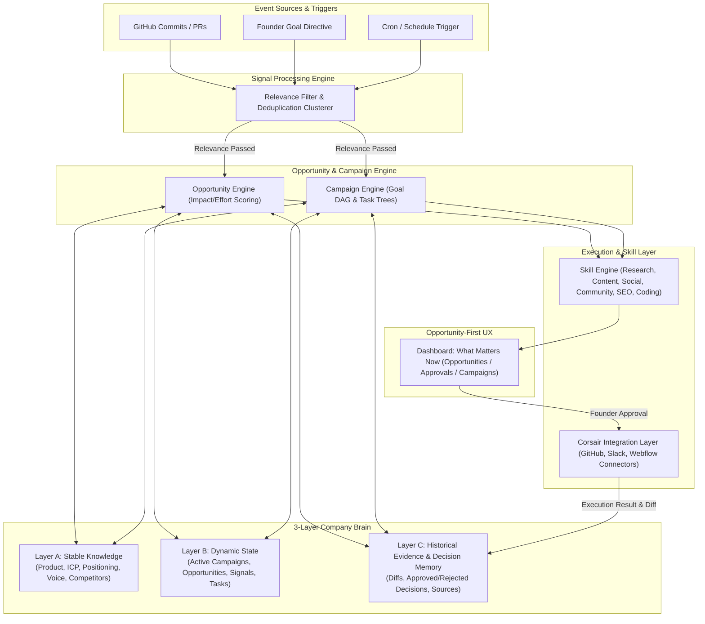

# SHOGUNCMO FINAL MVP SPECIFICATION v3

> **THIS MVP SPECIFICATION V3 IS THE AUTHORITATIVE AND AIRTIGHT PRODUCT SPECIFICATION FOR SHOGUNCMO. IT INCORPORATES ALL PRODUCT PRINCIPLES, DECISION MEMORY, DUAL MODES, SIGNAL CLUSTERING, AND OPPORTUNITY-FIRST UX.**

---

## 1. Product Definition

**ShogunCMO** is a memory-first, continuous AI Chief Marketing Officer for technical startups. It operates in both **Event-Driven** and **Goal-Driven** modes, ingesting first-party product and workspace signals, synthesizing them through a 3-layer Company Brain, and orchestrating evidence-grounded marketing campaigns across community, search, content, and developer channels with human-in-the-loop approval.

---

## 2. Primary User & Operating Context

- **Primary User:** The Technical Founder and Core Engineering Team at ShogunAI (led by founder Toru Tano and early startup teams).
- **Core Operating Need:** Execute continuous, authentic, high-signal GTM distribution (blog posts, developer forum engagement, technical SEO, Product Hunt launches) without hiring an external marketing agency or losing engineering focus.

---

## 3. Product Modes: Event-Driven vs. Goal-Driven

ShogunCMO operates across two primary modes to reflect how a real CMO works:

```text
┌────────────────────────────────────────────────────────────────────────┐
│                        MODE A: EVENT-DRIVEN                            │
│  GitHub Commit / PR Merge → Signal Deduplication → Relevance Gate    │
│  → Market Research → Opportunity Detection → Staged Action Cards       │
└────────────────────────────────────────────────────────────────────────┘
                                    &
┌────────────────────────────────────────────────────────────────────────┐
│                         MODE B: GOAL-DRIVEN                            │
│  Founder Directive ("Launch on Product Hunt next Friday")              │
│  → Strategy Synthesis → Campaign Creation → Task DAG → Execution       │
└────────────────────────────────────────────────────────────────────────┘
```

1. **Mode A (Event-Driven):** Passive, real-time background listening. Captures internal product signals (e.g. GitHub commits) or external market events, filters for relevance, and surfaces actionable opportunities.
2. **Mode B (Goal-Driven):** Proactive, objective-oriented campaign management. Takes high-level founder commands (e.g. *"Prepare ShogunAI for Product Hunt launch and target 500 waitlist signups"*), queries the Company Brain, builds a structured campaign plan, and executes the multi-channel task DAG.

---

## 4. Product Principles

1. **First-Party Signal Primacy:** Marketing actions originate from actual engineering work and founder goals, ensuring 100% authenticity without context drift.
2. **Relevance Gate Before Research:** Never burn API tokens or compute on noise; all signals pass through a strict relevance & deduplication filter before external research is triggered.
3. **Opportunity-First UX:** The user interface highlights *"What Matters Now"* (Opportunities, Active Campaigns, Pending Approvals) rather than exposing internal LLM agent implementation details.
4. **Decision Memory:** The system logs not only text edit diffs, but *why* a founder approved, edited, or rejected a recommendation, building a predictive model of founder preference.
5. **Human-in-the-Loop Side Effects:** All external side effects (CMS publishing, social posting, GitHub PR creation) require explicit founder approval (`Pending` $\rightarrow$ `Approved`/`Edited`/`Rejected` $\rightarrow$ `Executing` $\rightarrow$ `Executed`).

---

## 5. Architectural High-Level Diagram



---

## 6. The 3-Layer Company Brain

To prevent context retrieval degradation, the Company Brain is structured into 3 distinct operational layers:

### Layer A: Stable Knowledge (Who We Are)
- `Company & Product`: Name, domain, local memory architecture specs, technical capabilities.
- `ICP & Audience`: Developer personas, founder profiles, core pain points.
- `Positioning & Narrative`: "The New Game Shift", value vectors, competitive foils.
- `Brand Voice`: Tone rules, technical depth requirements, prohibited fluff words.
- `Competitors`: Competitor matrix (vs Okara, Rewind, Notion AI), positioning gaps.

### Layer B: Dynamic State (What Is Happening Now)
- `Active Signals`: Ingested and deduplicated event records.
- `Open Opportunities`: Scored growth leverage points awaiting action.
- `Active Campaigns`: Active multi-channel GTM initiatives (e.g. Product Hunt Launch).
- `Pending Tasks`: Staged content, social, SEO, and PR drafts awaiting approval.

### Layer C: Historical Evidence & Decision Memory (What We Learned)
- `Evidence Vault`: Source URLs, raw SERP HTML, thread citations backing recommendations.
- `Decision Memory`: Logged records of approved vs rejected recommendations and founder rationale.
- `Text Diffs`: Original AI draft vs final published text (for voice fine-tuning).
- `Execution Results`: Analytics, live URLs, open GitHub PR hashes.

---

## 7. Strategy Context Modules

Four core **Strategy Modules** exist within Layer A of the Company Brain and are injected into all LLM prompt windows prior to skill execution:

1. `Product Information`: Technical architecture, local vector memory specs, WASM runtimes.
2. `Marketing Strategy`: Channel playbooks, Product Hunt launch blueprints, content pillars.
3. `Competitor Analysis`: Competitive teardowns, keyword overlaps, positioning foils.
4. `Brand Voice & Tone`: Founder voice rules, technical language standards, editing guidelines.

---

## 8. Signal Engine: Relevance Gate & Deduplication

Signals are ingested from multiple sources but pass through a **Signal Filter** before triggering compute or web research:

### Signal Workflow:
```text
Raw Events (e.g., 5 commits on GitHub)
  ↓
Deduplication & Clustering Engine (Combines commits into 1 Product Update)
  ↓
Relevance Classifier (Asks: "Does this contain user-facing or technical GTM leverage?")
  ├── NO → Store in Layer B (Quiet Log) / End Workflow
  └── YES → Pass to Research & Opportunity Engine
```

### Supported Workflow Triggers (`WorkflowTrigger`):
- `event`: Ingested signal (e.g. GitHub PR merge).
- `schedule`: Recurring cron job (e.g. Daily r/Localllama discussion scan at 09:00 AM).
- `campaign`: Milestone step within an active campaign tree.
- `manual`: Founder command in the dashboard (e.g. *"Run a technical SEO audit"*).

---

## 9. Opportunity Engine & Decision Memory

An **Opportunity** represents a high-leverage growth action backed by evidence.

### Opportunity Model Attributes:
- `id`, `source_signal_id`, `campaign_id`
- `title`, `description`
- `impact_score` (1-10), `effort_score` (1-10), `confidence_score` (0.0-1.0)
- `relevance_reasoning`
- `evidence_citations` []
- `recommended_action_types` [] (e.g. `["community_reply", "content_article"]`)
- `status` (`detected`, `prioritized`, `actioned`, `ignored`)

### Decision Memory Schema:
When a founder approves, edits, or rejects an Opportunity recommendation, a **Decision Record** is stored in Layer C:
```json
{
  "id": "dec_789",
  "opportunity_id": "opp_456",
  "signal_type": "github_commit",
  "recommended_actions": ["community_reply", "seo_blog"],
  "chosen_action": "community_reply",
  "rejected_actions": ["seo_blog"],
  "rejection_reason": "Founder prefers community engagement over generic blog posts for minor feature releases",
  "actor": "toru",
  "timestamp": "2026-08-13T19:05:00Z"
}
```
*Effect:* Future Orchestrator prompts consume recent Decision Memory records, prioritizing community replies over blog posts when similar codebase signals arrive.

---

## 10. Campaigns & Task Trees

Campaigns represent goal-driven marketing initiatives (Mode B).

### Campaign Structure:
```text
Campaign: "ShogunAI Product Hunt V1 Launch"
├── Goal: "Reach #1 Product of the Day & 500 waitlist signups"
├── Target Date: "2026-09-01"
├── Opportunities []
└── Tasks []
    ├── Task 1: "Draft Maker Comment" (Skill: Content -> Asset: Markdown)
    ├── Task 2: "Prepare X Teaser Thread" (Skill: Social -> Asset: SocialScript)
    ├── Task 3: "Update llms.txt & Schema" (Skill: Coding -> Asset: GitHub PR)
    └── Task 4: "Stage Reddit Announcement" (Skill: Community -> Asset: CommunityDraft)
```

---

## 11. Skill Model (Unified Engine)

ShogunCMO uses a single **Orchestrator Agent** invoking modular, stateless **Skills** defined as version-controlled `SKILL.md` specifications:

- **Research Skill:** Leverages Tavily & Firecrawl to perform SERP analysis and community scanning.
- **Opportunity Skill:** Evaluates signal relevance, clusters events, and scores impact/effort.
- **Content Skill:** Drafts SEO articles, changelogs, and Product Hunt maker copy.
- **Social Skill:** Atomizes long-form technical updates into X/Twitter and LinkedIn threads.
- **Community Skill:** Crafts authentic, non-promotional responses for Reddit and Hacker News.
- **SEO / GEO Skill:** Diagnoses technical search health, Core Web Vitals, and AI engine citations.
- **Coding Skill:** Generates code diffs, `llms.txt`, and JSON-LD schemas, opening Pull Requests on GitHub.
- **Review Skill:** Audits drafts against Brand Voice guidelines and factual evidence before staging.

---

## 12. Evidence Architecture

Every recommendation, campaign task, and action card displayed in the UI includes an **Evidence Bundle**:

### Evidence Bundle Contents:
1. **Triggering Signal:** Raw commit diff, PRD link, or founder command.
2. **Company Brain Context:** Injected strategy modules and positioning quotes.
3. **External Research:** SERP ranking data, live thread URLs, and scraped text snippets.
4. **Confidence Score & Assumptions:** Explicit AI confidence score (0-100%) and list of underlying assumptions.
5. **Source Traceability:** Markdown link to exact source files and scraped URLs.

---

## 13. Approval System & State Machine

ShogunCMO enforces strict human-in-the-loop governance for all external side effects:

```text
[Draft Asset Generated]
       ↓
    PENDING (Staged in "What Matters Now" Dashboard)
       ↓
  ┌────┴───────────────────────────┬───────────────────────────┐
  ↓                                ↓                           ↓
APPROVED                        EDITED                      REJECTED
  ↓                                ↓                           ↓
[Execute Connector]       [Save Diff -> Layer C]       [Log Rejection -> Layer C]
  ↓                                ↓                           ↓
EXECUTED                        APPROVED                      END
```

- **Read-Only / Research:** Runs autonomously without human intervention.
- **Draft Staging:** Runs autonomously without human intervention.
- **External Side Effects (CMS Publish, GitHub PR, Social Post):** Requires explicit founder click (`Approve` or `Edit & Approve`).

---

## 14. Results & Learning Loop

After execution, ShogunCMO records an **Execution Result** in Layer C of the Company Brain:
- **Action Record:** Timestamp, target channel, external live URL.
- **Diff Log:** Diff between original AI draft and final founder-edited output.
- **Traction Metrics:** Views, clicks, signups, GitHub stars (mocked in MVP prototype, real in V1).
- **Learning Injection:** Edit diffs and decision logs are fed back into the `Brand Voice` prompt context for continuous calibration.

---

## 15. Opportunity-First UX ("What Matters Now")

The user interface avoids exposing internal LLM agent implementation details (e.g. "Agent 1 / Agent 2"). Instead, it presents an **Opportunity-First Dashboard**:

```text
┌────────────────────────────────────────────────────────────────────────┐
│                        SHOGUNCMO DASHBOARD                             │
├────────────────────────────────────────────────────────────────────────┤
│ 1. WHAT MATTERS NOW (High-Impact Scored Opportunities)                  │
│    [Opp-101] New Vector Indexing PR merged -> 3 Actions Recommended   │
├────────────────────────────────────────────────────────────────────────┤
│ 2. ACTIVE CAMPAIGNS                                                    │
│    [Campaign] Product Hunt Launch Prep (60% Completed - 4 Tasks Staged)│
├────────────────────────────────────────────────────────────────────────┤
│ 3. PENDING APPROVALS (Inbox Zero Feed)                                 │
│    [Card 1: CMS Article] "Why Local Vector Indexing Matters" [Publish] │
│    [Card 2: GitHub PR] "Update llms.txt with vector endpoints" [View PR]│
│    [Card 3: Reddit Draft] r/Localllama thread reply [Copy to Clipboard]│
├────────────────────────────────────────────────────────────────────────┤
│ 4. LIVE CMO TERMINAL (Real-time SSE Activity & LLM Router Stream)     │
└────────────────────────────────────────────────────────────────────────┘
```

---

## 16. Two Primary Demo Scenarios for Toru

### Demo Scenario 1: Mode A (Event-Driven Shipping Loop)
1. **Signal:** Toru merges a GitHub PR: `"feat: added instant local vector search indexer"`.
2. **Relevance Gate:** Signal Engine clusters commits, validates high marketing relevance.
3. **Research & Opportunity:** Research Skill scans r/Localllama via Tavily/Firecrawl, finding an active thread on local memory indexing. Creates Opp-101 (Impact 8/10).
4. **Staging:** Dashboard populates 3 Action Cards with full Evidence trace.
5. **Execution:** Toru clicks "Publish to CMS" $\rightarrow$ Webflow blog goes live. Toru clicks "Approve PR" $\rightarrow$ GitHub PR #14 opened.

### Demo Scenario 2: Mode B (Goal-Driven Campaign Loop)
1. **Command:** Toru enters manual goal command: `"Prepare ShogunAI for Product Hunt launch next Friday"`.
2. **Campaign Synthesis:** Orchestrator queries Layer A Strategy Modules, creates Campaign *"Product Hunt V1 Launch"*.
3. **Task Decomposition:** System builds a 4-task execution tree (Maker Comment, X Teaser, `llms.txt` PR, Community Staging).
4. **Execution:** Staged assets populate the active Campaign tab for 1-click review and execution.

---

## 17. Integrations & LLM Abstraction

### Integration Layer (Corsair SDK Adapter):
- **Corsair SDK:** Acts strictly as the **Integration Boundary** for OAuth, GitHub Octokit API, Slack Webhooks, and Webflow REST API. (Does NOT manage memory or product logic).
- **Database:** SQLite + `sqlite-vec` + FTS5 for local/prototype speed, migrating to Supabase Postgres in production.

### LLM Gateway Abstraction:
- **OrcaRouter API:** Managed gateway executing `model="auto"` for cost routing, `DeepSeek-R1` for strategic planning/reasoning, and `Claude 3.5 Sonnet` / `GPT-4o-mini` for draft generation.
- **Groq API:** `llama-3.3-70b-versatile` for high-speed, zero-cost research and commit diff parsing.

---

## 18. Corrected Success Metrics

1. **UX Execution Velocity:** Reduce founder GTM review and execution time to **< 15 seconds per release**.
2. **Traceable Context Fidelity:** **100% of generated outputs expose traceable source context and evidence** (commit diff hash, SERP URL, strategy module quote).
3. **Approval Safety:** **Zero unapproved external side effects**.
4. **LLM Cost Efficiency:** Benchmarked via OrcaRouter analytics (`x-orca-cache` HIT rate > 40%).

---

## 19. Defensible Competitive Differentiation

> **Defensible Differentiation:**
> *"ShogunCMO is designed around first-party product and workspace signals as continuous marketing triggers, operating in both event-driven and goal-driven modes while preserving the strategy $\rightarrow$ agent $\rightarrow$ approval model of an AI CMO."*

---

### SPECIFICATION V3 IS FROZEN AND READY FOR ARCHITECTURE IMPLEMENTATION PLANNING.
