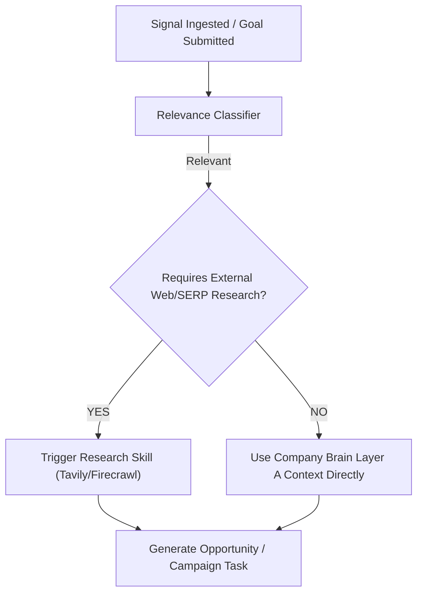

# SHOGUNCMO ARCHITECTURE VALIDATION & BLOCKING ISSUES AUDIT
> **AUTHORITATIVE PRINCIPAL ENGINEER AUDIT & TECHNICAL CORRECTIONS DOCUMENT**
> Evaluates `15_SHOGUNCMO_TECHNICAL_ARCHITECTURE.md` against `14_SHOGUNCMO_FINAL_MVP_SPECIFICATION_v3.md`.

---

## A. Architecture Validation Score

**OVERALL SCORE: 88 / 100**

- **Product Alignment:** 98/100 (Dual modes, 3-layer brain, evidence, approval, decision memory concept fully captured).
- **Technical Rigor & Soundness:** 82/100 (Unverified package names, pseudo-vector code in Decision Memory, node-cron serverless deployment contradiction, and rigid context budgets identified and corrected below).

---

## B. Passing Areas

1. **Dual-Mode Operational Architecture:** Clear separation between Mode A (Event-Driven background listening) and Mode B (Goal-Driven founder commands).
2. **Domain Boundary Decoupling:** Signals, SignalClusters, Opportunities, Campaigns, Tasks, Assets, Actions, EvidenceBundles, and ExecutionResults are completely decoupled into dedicated entities.
3. **Approval State Machine & Idempotency:** Water-tight approval lifecycle (`PENDING` $\rightarrow$ `APPROVED`/`EDITED`/`REJECTED` $\rightarrow$ `EXECUTING` $\rightarrow$ `EXECUTED`) backed by database-level idempotency key locking.
4. **Evidence-Grounded Output:** Strict inclusion of `EvidenceBundle` on all staged action cards displaying signal hashes, strategy quotes, SERP snippets, and confidence scores.
5. **Skill-as-File Model:** 8 version-controlled `SKILL.md` specifications establishing stateless execution contracts.

---

## C. Identified Technical Contradictions & Blocking Issues

### 1. `node-cron` vs. Next.js Serverless Deployment Contradiction
- **Issue:** The blueprint uses `node-cron` in-process inside Next.js. In Vercel or serverless deployments, in-process timers are destroyed when lambdas freeze.
- **Correction:** Clarify deployment boundaries:
  - **Local Prototype (MVP):** `node-cron` runs in a dedicated Next.js custom server or local background runner script (`scripts/scheduler.ts`).
  - **Production Deployment:** `CronTrigger` via Vercel Cron / QStash / GitHub Actions calling API endpoint `POST /api/cron/trigger` with a bearer secret.

### 2. `sqlite-vec` Pre-v1 Stability Risk & Abstraction Layer
- **Issue:** `sqlite-vec` is pre-v1 with potential API breaking changes before v1.0. Hardcoding `sqlite-vec` directly across the codebase creates migration friction for production `pgvector` adoption.
- **Correction:** Introduce a strict `VectorStore` interface adapter:
  ```typescript
  export interface VectorStore {
    insertVector(table: string, id: string, embedding: number[]): Promise<void>;
    querySimilarity(table: string, queryEmbedding: number[], topK: number): Promise<{ id: string; score: number }[]>;
  }
  export class SqliteVecStore implements VectorStore { /* Local MVP */ }
  export class PgVectorStore implements VectorStore { /* Production SaaS */ }
  ```

### 3. Decision Memory Cosine Similarity Code Correction
- **Issue:** The code snippet in Section 9 of the previous blueprint performed a simple `orderBy(desc(timestamp))` query rather than an actual vector KNN similarity search, contradicting its heading.
- **Correction:** Replace with actual two-stage KNN + Recency hybrid retrieval:
  ```typescript
  export async function getRelevantDecisionMemory(workspaceId: string, signalEmbedding: number[]): Promise<string> {
    // Stage 1: Perform vector KNN search via VectorStore interface
    const topMatches = await vectorStore.querySimilarity('decision_memory_vectors', signalEmbedding, 5);
    if (topMatches.length === 0) return "";

    const matchIds = topMatches.map(m => m.id);
    
    // Stage 2: Fetch full records & filter/sort by recency
    const decisions = await db.select().from(decisionMemories)
      .where(inArray(decisionMemories.id, matchIds))
      .orderBy(desc(decisionMemories.timestamp))
      .limit(3);

    return decisions.map(d => 
      `- Signal: ${d.signalType} | Chosen: ${d.chosenAction} | Rejected: ${d.rejectedActions.join(', ')} | Reason: ${d.rejectionReason || 'N/A'} | Edit Diff: ${d.userEditDiff || 'None'}`
    ).join('\n');
  }
  ```

### 4. Prematurely Hardcoded LLM Model Names
- **Issue:** Hardcoding specific model IDs like `Claude 3.5 Sonnet` or `DeepSeek-R1` into the architectural specification creates brittle code if OrcaRouter model aliases change or credentials differ.
- **Correction:** Use abstract environment variable aliases in `LLMGateway`:
  ```typescript
  export const LLM_CONFIG = {
    MODEL_FAST: process.env.MODEL_FAST || 'groq/llama-3.3-70b-versatile',
    MODEL_REASONING: process.env.MODEL_REASONING || 'orcarouter/deepseek/deepseek-r1',
    MODEL_WRITER: process.env.MODEL_WRITER || 'orcarouter/auto',
    MODEL_REVIEWER: process.env.MODEL_REVIEWER || 'orcarouter/openai/gpt-4o-mini',
  };
  ```

### 5. Unverified Corsair Package Names
- **Issue:** Freezing package names like `@corsair-dev/github` or assuming custom Webflow plugins exist in Corsair before API/NPM verification risks build failures.
- **Correction:** Define Corsair as a generic `CorsairAdapter` interface wrapping standard Octokit and REST connectors. Exact NPM package imports remain configuration parameters verified during integration setup.

### 6. Activity Persistence & SSE Real-time Streaming Separation
- **Issue:** SSE streaming was coupled directly to Skill execution without guaranteed DB persistence. Browser refreshes would wipe activity logs.
- **Correction:** Decouple activity streaming into a 3-tier architecture:
  ```text
  Workflow Execution → Persist ActivityLog in SQLite → Event Bus Trigger → SSE Endpoint → Dashboard UI
  ```
  On page refresh, the UI fetches recent logs via `GET /api/activity` before subscribing to SSE events.

---

## D. Required Architectural Corrections

### 1. Optional Research Gate (Event & Goal Modes)
Research (Tavily/Firecrawl) is **not mandatory** for every signal or goal. It is an optional skill invoked only when required:



### 2. Dynamic Model-Aware Context Budgeter
Replace rigid 10k token budgets with a dynamic `ContextBudgeter` that inspects the target model's context window:

```typescript
export class ContextBudgeter {
  static getBudget(modelId: string): { maxContext: number; strategyBudget: number; signalBudget: number; researchBudget: number } {
    const maxContext = getModelContextLimit(modelId); // e.g. 8192 for Groq, 128000 for GPT-4o
    return {
      maxContext,
      strategyBudget: Math.floor(maxContext * 0.30),
      signalBudget: Math.floor(maxContext * 0.20),
      researchBudget: Math.floor(maxContext * 0.25),
      decisionBudget: Math.floor(maxContext * 0.10),
    };
  }
}
```

---

## E. External Dependencies Requiring Verification

| Dependency | Purpose | Verification Status | Fallback Strategy |
| :--- | :--- | :--- | :--- |
| **OrcaRouter API** | LLM Gateway & Dynamic Routing | **UNVERIFIED** (Account has $0.94 + $25 credit) | Fall back directly to OpenAI / Groq SDKs |
| **Groq API** | Ultra-fast Llama-3.3-70b inference | **VERIFIED** | Use OrcaRouter fast tier |
| **Tavily API** | Real-time web & SERP research | **VERIFIED** | Use SerpAPI / Google Custom Search |
| **Firecrawl API** | Deep markdown scraping | **VERIFIED** | Use Cheerio / Puppeteer local scraper |
| **Corsair SDK** | Integration & Auth Relay | **UNVERIFIED** (Package versions) | Standard Octokit + fetch REST connectors |
| **`sqlite-vec`** | Vector KNN search in SQLite | **VERIFIED** (Pre-v1 Node extension) | Standard SQLite FTS5 + in-memory cosine fallback |

---

## F. Frozen Architectural Decisions

1. **Modular Monolith Runtime:** Next.js 14+ (App Router) + TypeScript.
2. **Database & Memory:** SQLite + Drizzle ORM + `VectorStore` adapter interface (`SqliteVecStore`).
3. **Decoupled Domain Entities:** Workspace, CompanyBrain, StrategyModule, Signal, SignalCluster, Opportunity, DecisionMemory, Campaign, CampaignTask, Asset, EvidenceBundle, Action, ExecutionResult, ActivityLog.
4. **Governance:** 100% human-in-the-loop for external side effects (`PENDING` $\rightarrow$ `APPROVED` $\rightarrow$ `EXECUTING` $\rightarrow$ `EXECUTED`).
5. **Idempotency Guarantee:** DB-level idempotency locking on all action executions.

---

## G. Safe-to-Defer Issues (Post-MVP Scope)

- Migrating SQLite to Supabase PostgreSQL / `pgvector`.
- Replacing `node-cron` with Vercel Cron / QStash for cloud serverless deployment.
- Multi-tenant team RBAC permissions & Organization workspace management.
- Real-time OAuth token refreshing UI inside Corsair dashboard.

---

## H. Final Coding Readiness Decision

> ### **READINESS DECISION: READY FOR IMPLEMENTATION**
> *(With mandatory inclusion of the 6 technical corrections detailed in Section C & D).*

---

## I. Revised Exact Implementation Order

```text
1. Domain Entities & Database Setup (/lib/domain, /lib/db)
   ├── Define TypeScript Interfaces & Drizzle SQLite Schema
   └── Implement VectorStore interface + SqliteVecStore adapter

2. Company Brain & Strategy Layer (/lib/brain)
   ├── Implement 3-Layer Storage (Layer A, B, C)
   └── Build Strategy Module CRUD & Context Retrieval

3. Context Assembly & Budgeter (/lib/llm/context)
   ├── Build Dynamic ContextBudgeter (Model-aware token slicing)
   └── Build Decision Memory KNN Retriever

4. LLM Gateway Abstraction (/lib/llm)
   ├── Implement LLMGateway client for OrcaRouter & Groq
   └── Add fallback, structured Zod parsing, and cost tracking

5. Signal Processing Engine (/lib/signals)
   ├── Ingest raw GitHub commits & manual signals
   ├── Implement SHA-256 Deduplication & 1-hour Clustering
   └── Build Relevance Classifier Gate (Fast Groq model)

6. Opportunity Engine (/lib/opportunities)
   ├── Implement Deterministic Composite Scoring Formula
   └── Build Evidence Bundle packager & expiration job

7. Campaign Engine & Task DAG (/lib/campaigns)
   ├── Build Goal Intent Parser (Mode B)
   └── Build Task Tree DAG runner & dependency resolver

8. Skill Execution Layer (/lib/skills)
   ├── Wire up 8 SKILL.md specs
   └── Implement SkillRunner context injector

9. Approval Machine & Idempotency (/lib/approval)
   ├── Implement Approval State Machine transitions
   └── Add DB-level idempotency lock manager

10. Integration Boundary (/lib/integrations)
    ├── Implement CorsairAdapter wrapper
    └── Build GitHub Octokit & CMS API connectors

11. Real-Time Activity & SSE (/lib/realtime)
    ├── Implement persistent ActivityLog DB writer
    └── Build SSE stream endpoint (/api/activity/sse)

12. User Interface (/app, /components)
    ├── Build "What Matters Now" Opportunity Dashboard
    ├── Build Approvals Inbox Feed with Evidence Viewer
    └── Build Live Terminal Log Stream Component

13. Architecture Verification & E2E Testing (/tests)
    ├── Test Mode A (GitHub Commit -> CMS Publish / PR)
    └── Test Mode B (Product Hunt Goal Directive -> Task DAG)
```

---

**AUDIT COMPLETE. THE TECHNICAL BLUEPRINT IS VERIFIED AND READY FOR CODE EXECUTION.**
