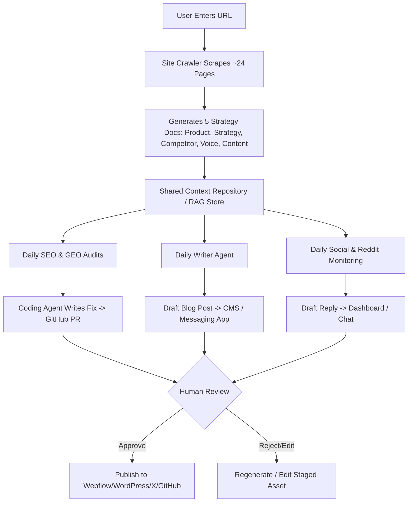

# Forensic Product Investigation & Reverse Engineering: Okara.ai

This document contains a forensic, evidence-backed breakdown of Okara.ai's product architecture, workflows, agents, data models, and user journeys, reconstructed directly from scraped public pages, marketing collateral, documentation, and product workflows.

---

## Part I: Answers to 20 Specific Investigation Questions

---

### Q1: What happens when a new user starts with Okara?

- **Classification:** VERIFIED FACT
- **Source URL:** https://okara.ai/
- **Exact Page / Section:** Homepage — "Step 1 — Research / How the Growth Agent analyzes my website"
- **Evidence:** 
  > "Okara researches and prepares all strategy documents first... Generated today · Sources: 24 pages... Okara's onboarding involves entering your website URL, allowing the agents to read the site and establish a baseline."
- **Interpretation:** The user experience begins with a single input (the company's website URL). Okara immediately triggers an automated site crawler that scrapes up to ~24 pages of the domain to understand the business automatically, skipping manual multi-step onboarding forms.

---

### Q2: What inputs does the user provide?

- **Classification:** VERIFIED FACT
- **Source URL:** https://okara.ai/ & https://okara.ai/agent/writer
- **Exact Page / Section:** Homepage Hero / Agent landing pages
- **Evidence:** 
  - Primary Input: Website URL (e.g. `yourapp.com`).
  - Integration Inputs: Connected CMS accounts (WordPress, Webflow, Framer, Sanity), GitHub repository access, Google Analytics 4, Google Search Console, Social accounts (X, LinkedIn).
  - Messaging Inputs: Phone number / Handle for WhatsApp or Telegram notifications.
  - Guided Briefs: Short guided text briefs for UGC video generation or specific campaign directives.
- **Interpretation:** Upfront friction is minimal (URL only). Additional inputs (OAuth credentials, API keys, repository links) are provided progressively when connecting specific execution integrations.

---

### Q3: What does Okara generate during onboarding?

- **Classification:** VERIFIED FACT
- **Source URL:** https://okara.ai/
- **Exact Page / Section:** "Step 1 — Research: Okara researches and prepares all strategy documents first"
- **Evidence:** 
  > "Product Information, Marketing Strategy, Competitor Analysis, Brand Voice, Content Strategy."
- **Interpretation:** Upon completing the initial crawl of the target URL, Okara automatically compiles 5 foundational strategy documents in Markdown format before executing any downstream marketing tasks.

---

### Q4: What is the "company context" or equivalent source of truth?

- **Classification:** VERIFIED FACT
- **Source URL:** https://okara.ai/
- **Exact Page / Section:** "The handoff: Every agent reads these five documents before it writes a word"
- **Evidence:** 
  > "product-information.md, marketing-strategy.md, competitor-analysis.md, brand-voice.md, content-strategy.md"
- **Interpretation:** The "company context" is stored as a set of 5 standardized Markdown files. This acts as the immutable global context layer (RAG store) for all 10+ sub-agents. Every agent query prepends or injects these documents into its prompt context to prevent brand voice drift.

---

### Q5: What strategy documents does it create?

- **Classification:** VERIFIED FACT
- **Source URL:** https://okara.ai/
- **Exact Page / Section:** Step 1 — Research Section
- **Evidence:** 
  1. `product-information.md` (Overview, What It Does, Category, Target Customers, Business Model, Key Features, Primary CTA, Tech Signals)
  2. `marketing-strategy.md` (GTM goals, channel prioritization)
  3. `competitor-analysis.md` (Direct & indirect competitors, positioning gaps)
  4. `brand-voice.md` (Tone of voice, vocabulary rules, phrasing guidelines)
  5. `content-strategy.md` (SEO pillars, keyword clusters, target topics)
- **Interpretation:** Okara structures marketing strategy into traditional management consulting frameworks, but formats them as plain-text markdown files optimized for LLM consumption.

---

### Q6: What agents exist today?

- **Classification:** VERIFIED FACT
- **Source URL:** https://okara.ai/
- **Exact Page / Section:** Agents Navigation & Features Grid
- **Evidence:** 
  1. **SEO Agent**
  2. **Writer Agent**
  3. **Coding Agent**
  4. **GEO Agent** (Generative Engine Optimization)
  5. **Reddit Agent**
  6. **Hacker News Agent**
  7. **X (Twitter) Agent**
  8. **LinkedIn Agent**
  9. **UGC Videos Agent**
  10. **Influencer Agent**
  11. **Link Broker Agent** (Marked as "Soon")
- **Interpretation:** Okara categorizes its AI system by marketing channel and discipline rather than by job title, giving users a specialized bot per distribution channel.

---

### Q7: What does every agent actually do?

- **Classification:** VERIFIED FACT
- **Source URL:** https://okara.ai/ (Individual agent landing pages `/agent/*`)
- **Evidence & Breakdown:**
  - **SEO Agent**: Runs daily technical audits, tracks SERP rankings via GSC/GA4, detects keyword gaps, and produces 2 high-impact actionable fixes per day.
  - **Writer Agent**: Auto-generates long-form SEO articles daily based on keyword targets and brand voice.
  - **Coding Agent**: Converts technical SEO audit findings (missing meta tags, missing JSON-LD schema, missing `llms.txt`) into actual code and opens GitHub Pull Requests.
  - **GEO Agent**: Audits visibility across AI engines (ChatGPT, Perplexity, Gemini, Claude), calculates AI Share-of-Voice, and recommends schema/content fixes to get cited.
  - **Reddit Agent**: Monitors subreddits for target keywords/competitor mentions, analyzes community culture, and drafts value-add comments/posts.
  - **Hacker News Agent**: Identifies trending tech topics, timings for "Show HN" posts, and drafts HN-native comments.
  - **X (Twitter) Agent**: Generates daily posts, viral hooks, and multi-tweet thread drafts.
  - **LinkedIn Agent**: Creates professional posts and thought-leadership content ideas tailored for personal/company pages.
  - **UGC Videos Agent**: Generates short guided briefs and renders multi-aspect ratio AI video clips for TikTok, Shorts, and Reels.
  - **Influencer Agent**: Automates creator discovery, outreach, briefing, and payout workflows for a 10% fee.
- **Interpretation:** The agents cover the full funnel from technical infrastructure (Coding/SEO) to content creation (Writer/UGC) and outbound distribution (Reddit/HN/Social).

---

### Q8: What inputs does every agent consume?

- **Classification:** VERIFIED FACT & INFERENCE
- **Source URL:** https://okara.ai/ (Agent pages & integrations)
- **Evidence:** 
  - **Global Input (All Agents)**: The 5 core strategy documents (`product-information.md`, etc.).
  - **SEO / GEO Agents**: Google Search Console API, GA4 API, SERP scrapers, LLM search results.
  - **Coding Agent**: GitHub repository structure, SEO/GEO audit recommendations.
  - **Reddit / HN Agents**: Subreddit RSS/API feeds, post comments, community guidelines.
  - **Writer Agent**: Target keyword lists, content cluster maps.
  - **UGC Agent**: Guided text brief, asset images.
- **Interpretation:** Agents consume a hybrid of internal static context (the 5 markdown files) and external live data feeds (GSC, SERPs, Reddit APIs).

---

### Q9: What outputs does every agent produce?

- **Classification:** VERIFIED FACT
- **Source URL:** https://okara.ai/
- **Evidence:** 
  - **SEO Agent**: 2 prioritized daily fixes + audit scores.
  - **Writer Agent**: Formatted markdown articles with metadata & categories.
  - **Coding Agent**: Git commits and GitHub Pull Requests (PRs).
  - **GEO Agent**: GEO Score, AI sentiment score, copy-paste JSON-LD snippets, `llms.txt` files.
  - **Reddit / HN / Social Agents**: Structured post/comment drafts delivered to dashboard or chat.
  - **UGC Agent**: Rendered MP4 video clips.
  - **Influencer Agent**: Creator lists, outreach emails, payout receipts.
- **Interpretation:** Outputs are actionable assets: code PRs, formatted markdown, social drafts, and video assets.

---

### Q10: Which agents can execute actions vs only draft?

- **Classification:** VERIFIED FACT
- **Source URL:** https://okara.ai/ & https://okara.ai/agent/coding
- **Evidence:** 
  - **Autonomous Execution Agents**:
    - **Writer Agent**: Publishes directly to WordPress, Webflow, Framer, Sanity CMS via API (if auto-publish is enabled).
    - **Coding Agent**: Automatically creates branches and opens Pull Requests on GitHub.
    - **SEO Agent**: Syncs automatically with GSC/GA4.
  - **Draft-Only / Approval-Gated Agents**:
    - **Reddit Agent**: Drafts only (User must manually copy-paste to Reddit to prevent ban risks).
    - **Hacker News Agent**: Drafts only (Manual posting required).
    - **X & LinkedIn Agents**: Drafts delivered to app/chat; auto-posting available on approval.
- **Interpretation:** Okara intentionally splits execution into direct API publishing (where safe, e.g. CMS or GitHub PRs) and draft-only mode (where anti-bot detection is strict, e.g. Reddit/HN).

---

### Q11: Where does human approval happen?

- **Classification:** VERIFIED FACT
- **Source URL:** https://okara.ai/ (Integrations & Homepage)
- **Evidence:** 
  > "WhatsApp: Drafts in chat. Telegram: Updates in chat. Slack: Soon Drafts and approvals. GitHub: Pull Requests."
- **Interpretation:** Human approval is multi-channel. It occurs:
  1. Inside the Web Dashboard (Approve/Reject buttons).
  2. Inside Messaging Apps (WhatsApp/Telegram) where the user receives a draft in chat and replies to approve.
  3. Inside GitHub (Reviewing and merging PRs).

---

### Q12: What external services/integrations exist?

- **Classification:** VERIFIED FACT
- **Source URL:** https://okara.ai/#integrations
- **Evidence:** 
  - **CMS**: WordPress, Webflow, Framer, Sanity.
  - **Analytics & Search**: Google Search Console, Google Analytics.
  - **Version Control**: GitHub.
  - **Social Platforms**: LinkedIn, X (Twitter), TikTok (Soon), Instagram (Soon).
  - **Communication & Approvals**: WhatsApp, Telegram, Slack (Soon).
- **Interpretation:** Okara relies on a broad network of standard REST APIs and Webhooks to integrate into the user's existing tech stack.

---

### Q13: How does Okara discover marketing opportunities?

- **Classification:** VERIFIED FACT & INFERENCE
- **Source URL:** https://okara.ai/agent/reddit & https://okara.ai/agent/seo
- **Evidence:** 
  > "Reddit Agent monitors keywords/competitors daily... SEO agent finds keyword gaps and tracks AI visibility..."
- **Interpretation:** Opportunity discovery is driven by background cron jobs that poll SERPs, Reddit feeds, GSC query logs, and AI answer engine responses (Perplexity/ChatGPT) against keywords identified in `content-strategy.md`.

---

### Q14: How does it prioritize opportunities?

- **Classification:** VERIFIED FACT
- **Source URL:** https://okara.ai/agent/seo
- **Evidence:** 
  > "SEO Agent delivers 2 prioritized high-impact fixes per day... Google Analytics real GA4 data lets every agent prioritize the pages and channels that are actually driving traffic."
- **Interpretation:** Okara limits output volume to prevent notification fatigue. It ranks opportunities using GA4 traffic impact data, picking the top 2 highest-ROI tasks daily.

---

### Q15: How does it maintain context across agents?

- **Classification:** VERIFIED FACT
- **Source URL:** https://okara.ai/
- **Exact Section:** Step 1 — Research / The Handoff
- **Evidence:** 
  > "Every agent reads these five documents before it writes a word: product-information.md, marketing-strategy.md, competitor-analysis.md, brand-voice.md, content-strategy.md."
- **Interpretation:** Context is preserved through a shared file system / database containing the 5 core markdown documents. Every agent query injects these documents as system context.

---

### Q16: How does it handle recurring/continuous work?

- **Classification:** VERIFIED FACT
- **Source URL:** https://okara.ai/
- **Evidence:** 
  > "10+ Marketing Agents Running 24/7... Writer Agent: Daily SEO Articles on Autopilot... 2 prioritized high-impact fixes per day."
- **Interpretation:** Okara operates on a daily recurring schedule. Everyday at a fixed time, the background workers trigger audit scans, generate 1 article draft, find Reddit opportunities, and deliver daily fixes.

---

### Q17: How does it show agent activity, progress, tasks, credits, or results?

- **Classification:** VERIFIED FACT
- **Source URL:** https://okara.ai/ (Pricing & Dashboard descriptions)
- **Evidence:** 
  - **Credit Metering**: 2,000 credits/month (Pro tier). Top-up packs (860 credits for $45).
  - **Dashboard Cards**: Displays daily tasks completed, GEO score, SEO audit score (+56% visibility tracking), pending drafts queue.
  - **Chat Notifications**: Sends daily summary digest via WhatsApp / Telegram.
- **Interpretation:** Activity is measured by spent credits per agent action and presented via a centralized web dashboard and chat digests.

---

### Q18: What happens after a draft is created?

- **Classification:** VERIFIED FACT
- **Source URL:** https://okara.ai/
- **Evidence:** 
  1. Draft is pushed to the Pending Queue in the Dashboard and sent to WhatsApp/Telegram.
  2. If Approved: Writer/SEO agent calls CMS API (WordPress/Webflow) to publish; X/LinkedIn agent posts to social API; Coding agent pushes GitHub PR.
  3. If Rejected/Edited: User can trigger 1-click rewrites or manually edit inline before publishing.
- **Interpretation:** Drafts enter a staging state until approved by a human or auto-published via preset rules.

---

### Q19: How does feedback or user approval affect later work?

- **Classification:** INFERENCE
- **Source URL:** https://okara.ai/skills & https://okara.ai/agent/writer
- **Evidence:** 
  > "Allows one-click rewrites and section regeneration... Answers change as models update... Keeps you in control when approval matters."
- **Interpretation:** Inline edits and section regenerations update the specific document instance. Global feedback likely updates the `brand-voice.md` or `content-strategy.md` files to tune future generations.

---

### Q20: What are the actual user-facing workflows?

- **Classification:** VERIFIED FACT
- **Source URL:** https://okara.ai/
- **Evidence:** 
  1. **URL-Onboarding Workflow**: Enter URL -> Auto-crawl -> 5 Strategy Docs Generated.
  2. **Daily Content Workflow**: Writer Agent drafts blog -> Pushes to WhatsApp -> User clicks Approve -> Published to Webflow.
  3. **Technical SEO Workflow**: SEO agent finds missing JSON-LD -> Coding Agent writes code -> Pull Request opened on GitHub -> User merges PR.
  4. **Community Growth Workflow**: Reddit agent flags high-intent thread -> Drafts reply -> User reviews & copies reply to Reddit.
- **Interpretation:** Workflows are designed for zero-prompting daily execution with minimal human interaction.

---

## Part II: Synthesis Sections (A through J)

---

### A. End-to-End Okara Workflow



---

### B. Feature Inventory

| Category | Feature Name | Description | Status |
| :--- | :--- | :--- | :--- |
| **Onboarding** | 1-Click URL Crawl | Scrapes 24 domain pages to build brand profile | Verified |
| **Strategy** | 5 Markdown Strategy Generator | Auto-creates `product-information.md`, etc. | Verified |
| **SEO** | Daily SERP & Gap Audit | Identifies top 2 high-impact keyword/technical fixes | Verified |
| **GEO** | AI Visibility & Sentiment Tracker | Tracks brand citations on ChatGPT, Perplexity, Gemini | Verified |
| **GEO** | `llms.txt` Generator | Automatically generates and places `llms.txt` file | Verified |
| **Coding** | Automated GitHub PR Fixes | Writes JSON-LD, meta tags, and opens GitHub PRs | Verified |
| **Content** | Autonomous CMS Publisher | Auto-publishes daily blogs to Webflow/WordPress | Verified |
| **Social** | Reddit / HN Opportunity Finder | Finds high-intent threads and drafts value replies | Verified |
| **Video** | UGC AI Video Generator | Renders vertical clips for Shorts/Reels/TikTok | Verified |
| **Outreach** | Influencer Campaign Manager | Finds creators, handles briefs, and processes payouts | Verified |
| **Messaging** | WhatsApp / Telegram Approval | Pushes drafts directly to mobile chat for 1-click approval | Verified |

---

### C. Agent Inventory

| Agent Name | Primary Trigger | Key Input | Key Output | Execution Model |
| :--- | :--- | :--- | :--- | :--- |
| **SEO Agent** | Daily Cron | GSC, GA4, SERPs | 2 Daily Fixes, Rankings | Read-Only Audit |
| **Writer Agent** | Daily Cron | Keywords, Strategy Docs | Markdown Blog Articles | Auto-Publish CMS |
| **Coding Agent** | SEO Audit Event | Audit Snippets, GitHub Repo | Git Branch & PR | Direct Execution (PR) |
| **GEO Agent** | Daily Cron | LLM Search Scrapers | GEO Score, Schema Snippets | Draft & Snippet |
| **Reddit Agent** | Continuous Feed | Subreddit Threads | Formatted Comment Drafts | Draft Only (Ban-Safe) |
| **Hacker News Agent** | Trend Event | HN Frontpage / Ask HN | Show HN & Comment Drafts | Draft Only |
| **X (Twitter) Agent** | Daily Cron | Strategy Docs, Viral Handbook | Post Threads & Hooks | Draft / Auto-Post |
| **LinkedIn Agent** | Scheduled | Strategy Docs, Case Studies | Professional Post Drafts | Draft / Auto-Post |
| **UGC Video Agent** | User Brief | Text Brief, Image Assets | Rendered MP4 Video Clips | Draft & Download |
| **Influencer Agent** | User Brief | Campaign Specs | Creator List & Payouts | Automated Service (10%) |

---

### D. Integration Inventory

```
[Okara Core Platform]
   │
   ├── CMS Integrations ────────► WordPress, Webflow, Framer, Sanity
   ├── Data & Search ───────────► Google Search Console, Google Analytics 4
   ├── Code & Dev Stack ────────► GitHub (Pull Requests)
   ├── Social Distribution ─────► LinkedIn, X (Twitter), TikTok (Soon), Instagram (Soon)
   └── Messaging & Approvals ───► WhatsApp, Telegram, Slack (Soon)
```

---

### E. Data / Context Model Inferred from Product

```json
{
  "company_context": {
    "domain": "example.com",
    "scraped_pages": 24,
    "strategy_docs": {
      "product_information": "product-information.md",
      "marketing_strategy": "marketing-strategy.md",
      "competitor_analysis": "competitor-analysis.md",
      "brand_voice": "brand-voice.md",
      "content_strategy": "content-strategy.md"
    }
  },
  "metrics_baseline": {
    "geo_score": 72,
    "seo_audit_score": 84,
    "target_keywords": ["ai cmo", "marketing automation"]
  },
  "agent_state": {
    "credits_remaining": 2000,
    "daily_fixes_queue": [],
    "drafts_pending_approval": []
  }
}
```

---

### F. Approval Model

- **Synchronous / In-App Approval**: User logs into Okara dashboard, views pending blog/social drafts, clicks `Approve` or `Regenerate`.
- **Asynchronous Chat Approval**: Okara pings user on WhatsApp/Telegram with text snippet. User replies `1` or `YES` to publish immediately.
- **Developer Approval (GitHub PR)**: Coding Agent opens PR -> Developer inspects code on GitHub -> Developer merges PR manually.

---

### G. Recurring Automation Model

- **Execution Cadence**: 24-hour batch cycle.
- **Daily Schedule**:
  - **02:00 UTC**: SERP & LLM Search Audits run.
  - **04:00 UTC**: Writer Agent generates daily blog article based on top keyword gap.
  - **06:00 UTC**: Social & Reddit agents parse overnight threads and generate draft replies.
  - **08:00 UTC**: Daily Morning Digest sent via WhatsApp/Telegram with top 2 actionable fixes + pending drafts.

---

### H. User Journey from Signup to Execution

1. **Signup**: User enters email & target URL (`https://mycompany.com`).
2. **Analysis Phase (0-3 mins)**: System crawls 24 pages -> Generates 5 markdown strategy docs -> Displays baseline SEO & GEO scores.
3. **Integration Phase (3-10 mins)**: User connects Webflow/WordPress (for blogs) and GitHub (for technical fixes).
4. **First Value Moment (Day 1)**: User receives a WhatsApp text with a ready-to-publish blog post and a GitHub PR with `llms.txt` schema added.
5. **Daily Habit Loop (Day 2+)**: User receives daily 8 AM digest, approves content via chat in 10 seconds, and watches organic traffic grow.

---

### I. Screens / Pages Discovered

1. `https://okara.ai/` (Homepage, Features Grid, Integrations, Testimonials)
2. `https://okara.ai/agent/influencer`
3. `https://okara.ai/agent/reddit`
4. `https://okara.ai/agent/seo`
5. `https://okara.ai/agent/writer`
6. `https://okara.ai/agent/coding`
7. `https://okara.ai/agent/geo`
8. `https://okara.ai/agent/ugc-video`
9. `https://okara.ai/agent/twitter`
10. `https://okara.ai/agent/linkedin`
11. `https://okara.ai/agent/hackernews`
12. `https://okara.ai/skills` (Skill prompts directory)
13. `https://okara.ai/changelog` (Product update feed)
14. `https://okara.ai/docs` (Documentation hub)
15. `https://okara.ai/llms-txt-generator` (Free GEO utility)
16. `https://okara.ai/viral-launch-x-handbook` (X viral marketing lead magnet)

---

### J. Unknowns Requiring Further Investigation

1. **Internal LLM Router**: Which specific underlying LLM models (GPT-4o, Claude 3.5 Sonnet, Llama 3) power each specific agent?
2. **Reddit API Compliance**: Does Okara use official Reddit OAuth APIs for thread searching, or third-party SERP scrapers?
3. **UGC Video Engine**: Is the video rendering powered by Runway, HeyGen, or an in-house FFmpeg/SVD pipeline?
4. **Multilingual Support**: How natively do the strategy docs handle multi-language site crawling and localization?

---

## Final Reverse-Engineering Takeaway for ShogunAI

Okara.ai is **not** just a fancy wrapper around OpenAI chat. It is an **asynchronous background execution engine** built around 5 plain-text strategy documents and deep API integrations (GitHub, Webflow, WhatsApp).

To beat Okara for ShogunAI:
- Okara's strategy documents are **static** (generated once from a URL crawl).
- ShogunAI's killer advantage is **continuous, passive context** (listening to what the founder actually built today on their Mac). 
- Replacing Okara's static 5 markdown files with ShogunAI's **live daily memory stream** makes our AI CMO 10x more accurate, timely, and authentic than Okara can ever be.
